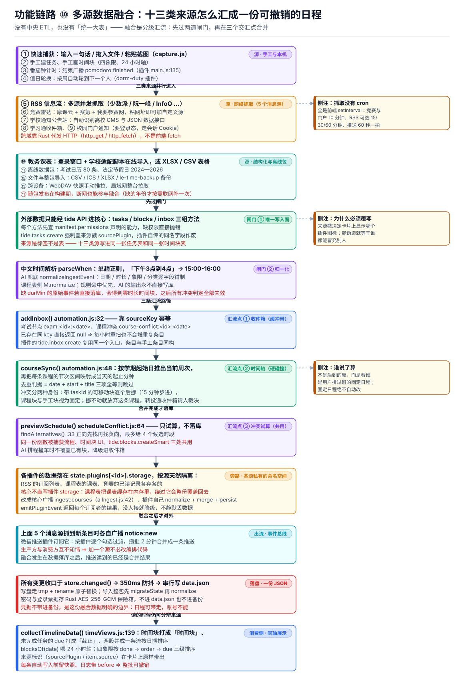
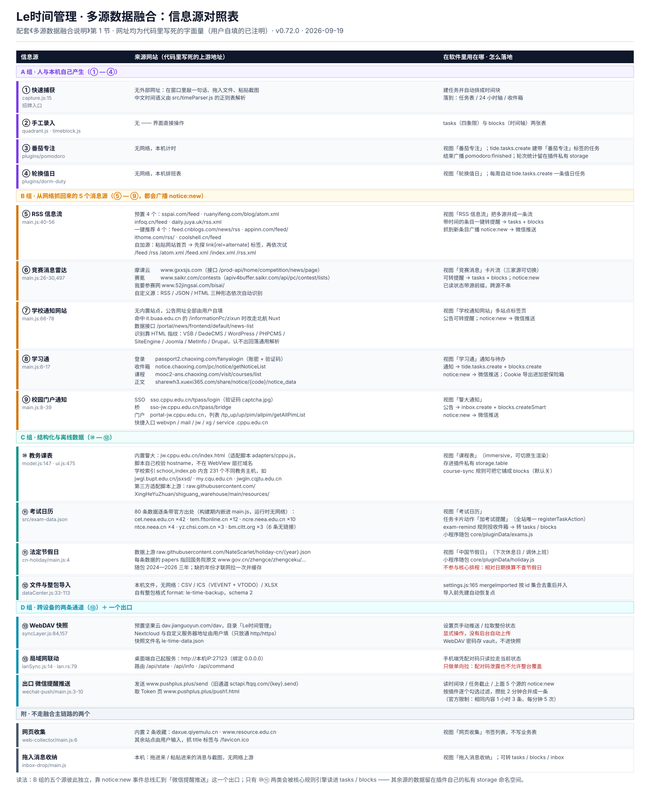

# 一个无框架的日程软件，是怎么把十三类数据捏成同一根时间轴的

> **文档性质**：对外技术科普（架构篇 · 数据融合专题），可直接改写为公众号长文。
> **基准版本**：v0.72.0 · **统计日期**：2026 年 9 月 19 日
> 本文是纯文档，不进产品 bundle，按 [`AGENTS.md`](../AGENTS.md) 铁律一**不需要**升版本号。
> 架构图由 `node tools/gen-architecture-diagrams.js` 生成到 `docs/architecture/`，改文案不用手画。
> 文中 `文件:行号` 是写作当日工作区的实际位置；产品代码在动，行号会漂，**函数名不会漂**。

---

## 0. 先说清楚难点在哪

一个学生的一天，信息是从这些地方漏进来的：教务系统的课表、学习通的作业通知、学院官网的公告、考试报名时间、微信群转发的竞赛通知、自己随手记的一句「周四下午交读书报告」。

多数待办软件对这件事的解法是「让用户自己搬」——软件提供一个输入框，剩下的靠人。而人是最不可靠的搬运工：搬回来的一堆条目格式不一、时间语义模糊，最后都堆成没人看的列表。

**所以真正的问题从来不是「能不能存下这些数据」，而是三件更硬的事：**

| 难题 | 具体表现 |
|---|---|
| 格式各不相同 | 课表是「周三 3-4 节」，通知是「11 月 20 日报名截止」，RSS 是一篇长文章 |
| 同一件事会重复出现 | 竞赛雷达抓到一次，学校公告抓到一次，微信群里又看到一次 |
| **两条日程撞车时谁说了算** | 课程固定在 08:00-09:40，用户自己的「晨跑」也在这里 |

这篇就讲这三件事在这套代码里是怎么落地的。先给结论：

> **它没有中央 ETL，也没有「统一大表」。**
> 融合是**分级汇流**：十三类来源先各自流到入口，过两道闸门（唯一写入面、归一化），
> 然后在三个交汇点（收件箱、时间轴、冲突试算）完成合并，最后才落到一个 JSON 文件里。
> 来源在融合后**依然可辨**——它变成条目上的一个标签，而不是一张表。



---

## 1. 十三类来源分别是什么

### A 组 · 人和设备自己产生的（① — ④）

- **① 快速捕获**：输入框敲一句话，或者把文件拖进窗口、把截图粘进来。中文时间语义由一个手写正则解析器处理，「下午3点到4点」直接变 `15:00-16:00`。
- **② 手工录入**：四象限里建任务、24 小时轴上画时间块。
- **③ 番茄钟计时**：一个内置插件。它建的「番茄专注」任务是普通任务（时长取一个专注区间），进共享任务表；而「今日完成 4 个 / 累计 100 分钟」这类统计留在插件自己的私有存储里，计时结束只广播一个 `pomodoro:finished` 事件。
- **④ 本机派生数据**：宿舍值日轮换表（按周自动轮到下一个人）。

这一组一上来就给出了整篇文章最重要的一条分界线：**值得被别人看到的事实进共享表，只有这个功能自己用得上的留在私有命名空间。** 后面还会反复遇到它。

### B 组 · 从网络抓回来的（⑤ — ⑨）

五个「消息源」插件，它们就是用户口中的「多源」最直观的那一半：

| # | 源 | 抓什么 | 「源」在这一层又细分成几个 |
|---|---|---|---|
| ⑤ | RSS 信息流 | 多个 RSS/Atom 订阅 | 内置 4 个（少数派、阮一峰、InfoQ 中文、橘鸦早报）＋推荐源＋用户自加，**多 feed 并发抓取** |
| ⑥ | 竞赛消息雷达 | 竞赛公告 | 内置三家：摩课云、赛氪竞赛广场、我要参赛网；**粘一个网址就能加自定义源**（自动识别 RSS / JSON / HTML） |
| ⑦ | 学校通知网站 | 学院官网公告 | 用户自填网址，自动识别高校 CMS；命中已登记的数据接口时直接读 JSON |
| ⑧ | 学习通 | 消息收件箱 + 作业/考试 | 需要登录态 |
| ⑨ | 校园门户通知 | 智慧门户待办 | 需要 SSO 登录态 |

两个技术细节值得一提：

**跨域不是前端解决的。** WebView 里 fetch 会被 CORS 挡掉，所以抓取的最后一跳交给 Rust 侧代发（`http_get` / `http_fetch`）。响应解码也不按默认的 UTF-8 —— 不少校园站还停在 GB2312 / GBK，必须按 `Content-Type` 与 `<meta charset>` 的声明解，否则整页乱码。

**登录态是导出来的，不是重登的。** ⑧⑨ 这类要验证码的站点，把会话 Cookie 整体导出、存进 Rust 侧的加密保险箱，应用重启后恢复。代价是首次要人工过一次登录。

至于调度：**没有 cron，没有后台进程**，全是插件自己的 `setInterval`——竞赛和门户 10 分钟一轮，RSS 可选 15/30/60 分钟，推送插件 60 秒一拍。窗口关着就不会更新，这是刻意的简化。

### C 组 · 结构化和离线的（⑩ — ⑫）

- **⑩ 教务课表**：两条路。在线导入是打开一个受控登录窗口、跑学校适配脚本抓回课表；离线则直接导 XLSX / CSV 表格。
- **⑪ 离线数据包**：**80 条考试日历**（报名时间、打印准考、考试日三种节点，71 条已确认 + 9 条预估）、**2024—2026 法定节假日**（上游 NateScarlet/holiday-cn，数据文件里保留着国务院原文链接）。这两份在**构建期就打进制物**，断网也能参与融合；只有遇到没内置的年份才联网补一次并缓存。
- **⑫ 文件与整包导入**：CSV / ICS（含 VTODO）/ XLSX，以及自有的 `le-time-backup` 整包 JSON。

第 ⑪ 项是很多人对「多源融合」的一个误解：以为源必须是活的。对这个软件来说，**一份编译进包的数据集和一个每小时刷新的 RSS，是同一类东西**——都是外部事实，最后都汇进同一个缓冲带或同一张时间块表。

### D 组 · 跨设备的（⑬）

- **WebDAV 快照**：整份状态打包成一个 JSON，用户手动推 / 拉。
- **局域网整台拉取**：桌面端起一个 HTTP 服务，手机在同一 WiFi 下拉走当前状态。**只做单向拉，不做推送**——因为配对码一旦泄露，推送等于允许别人整台覆盖你。

---

## 1.5 信息源对照表：来源网站 · 用在哪



> 上面这张由 `node tools/gen-architecture-diagrams.js` 生成（`docs/architecture/11-sources-map.svg`）。
> **网址一律摘自代码里的字面量**；凡用户自填的都直接写明，不冒充内置源。

### A 组 · 人与本机产生

| 源 | 来源网站 | 用在哪 | 代码位置 |
|---|---|---|---|
| ① 快速捕获 | 无外部网址（敲一句话 / 拖文件 / 粘截图） | 建任务 + 自动排时间块 → 任务表、24 小时轴、收件箱 | `src/capture.js:15`、`src/timeParser.js:4` |
| ② 手工录入 | 无 | 四象限 `tasks`、时间轴 `blocks` | `src/views/quadrant.js`、`src/views/timeblock.js` |
| ③ 番茄专注 | 无网络，本机计时 | 视图「番茄专注」；`tide.tasks.create` 建带「番茄专注」标签的任务；结束广播 `pomodoro:finished`；轮次统计留在插件私有 storage | `public/plugins/pomodoro/main.js:135,469` |
| ④ 轮换值日 | 无网络，本机排班 | 视图「轮换值日」；每周自动建一条值日任务 | `public/plugins/dorm-duty/main.js` |

### B 组 · 五个网络消息源（都广播 `notice:new` 给微信推送）

| 源 | 来源网站（代码写死的上游） | 用在哪 | 代码位置 |
|---|---|---|---|
| ⑤ RSS 信息流 | 预置 4：`sspai.com/feed`、`www.ruanyifeng.com/blog/atom.xml`、`www.infoq.cn/feed`、`daily.juya.uk/rss.xml`；一键推荐 4：`feed.cnblogs.com/news/rss`、`www.appinn.com/feed/`、`www.ithome.com/rss/`、`coolshell.cn/feed`；自加源可粘网站首页，先探 `link[rel=alternate]` 再试 `/feed` `/rss` `/atom.xml` `/feed.xml` `/index.xml` `/rss.xml` | 视图「RSS 信息流」把多 feed 并成一条流；带时间的条目一键转提醒 → `tasks` + `blocks`；新条目 → 微信推送 | `rss-reader/main.js:40-56,603-637,551` |
| ⑥ 竞赛消息雷达 | 摩课云 `www.gxxsjs.com`（接口 `/prod-api/home/competition/news/page`）、赛氪 `www.saikr.com/contests`（接口 `apiv4buffer.saikr.com/api/pc/contest/lists`）、我要参赛网 `www.52jingsai.com/bisai/`；自定义源按 RSS → JSON → HTML 依次自动识别 | 视图「竞赛消息」三家可切；转提醒 → `tasks` + `blocks`；`notice:new` → 微信推送；已读 id 带源前缀防跨源串味 | `gx-news/main.js:26-30,468-509,584` |
| ⑦ 学校通知网站 | **无内置站点，公告网址全部用户自填**；命中 `it.buaa.edu.cn` 的 `/informationPc/zixun` 时改走北航 Nuxt 数据接口 `/portal/news/frontend/default/news-list`；CMS 靠 HTML 指纹识别（VSB / DedeCMS / WordPress / PHPCMS / SiteEngine / Joomla / MetInfo / Drupal） | 视图「学校通知网站」多站点标签页；公告转提醒；`notice:new` | `school-notice/main.js:66-78,139`、`src/webContent.js:299-358` |
| ⑧ 学习通 | 登录 `passport2.chaoxing.com/fanyalogin`；收件箱 `notice.chaoxing.com/pc/notice/getNoticeList`；课程 `mooc2-ans.chaoxing.com/visit/courses/list`；正文 `sharewh3.xuexi365.com/share/notice/{code}/notice_data` | 视图「学习通」；通知 → `tide.tasks.create` + `blocks.create`；`notice:new`；会话 Cookie 导出进加密保险箱 | `chaoxing-notify/main.js:6-17,473,508` |
| ⑨ 校园门户通知 | SSO `sso.cppu.edu.cn/tpass/login`（带验证码）→ 桥 `sso-jw.cppu.edu.cn/tpass/bridge` → 门户 `portal-jw.cppu.edu.cn`（列表 `/tp_up/up/pim/allpim/getAllPimList`）；快捷入口 `webvpn` / `mail` / `jw` / `xg` / `service` `.cppu.edu.cn` | 视图「警大通知」；`inbox.create` + `blocks.createSmart`；`notice:new` | `cppu-notify/main.js:8-39,781,803` |

### C 组 · 结构化与离线

| 源 | 来源网站 | 用在哪 | 代码位置 |
|---|---|---|---|
| ⑩ 教务课表 | 内置警大 `jw.cppu.edu.cn/index.html`（适配脚本 `adapters/cppu.js:148` **在脚本内**校验 hostname，WebView 层不拦域名）；学校索引 `school_index.pb` 内含 **231 个不同教务主机**（如 `jwgl.bupt.edu.cn/jsxsd/`、`my.cqu.edu.cn`、`jwgln.cqjtu.edu.cn`）；第三方适配脚本上游 `raw.githubusercontent.com/XingHeYuZhuan/shiguang_warehouse` | 视图「课程表」（immersive，可切原生渲染）；数据存插件私有 `storage.table`；`course-sync` 规则可把它铺成 `blocks`（**默认关**） | `shiguang-schedule/model.js:147`、`ui.js:475-478`、`src/automation.js:48` |
| ⑪ 考试日历 | 80 条数据逐条带官方出处：`cet.neea.edu.cn` ×42、`tem.fltonline.cn` ×12、`ncre.neea.edu.cn` ×10、`ntce.neea.cn` ×4、`yz.chsi.com.cn` ×3、`bm.cltt.org` ×3（另 6 条无链接）。构建期内嵌进 `main.js`，运行时无网络 | 视图「考试日历」；**全站唯一的任务卡片动作**「加考试提醒」；`exam-remind` 规则投收件箱 → 转 `tasks` / `blocks`；小程序随包 `core/pluginData/exams.js` | `exam-calendar/src/exam-data.json:2-9,43-55`、`src/automation.js:39` |
| ⑪ 法定节假日 | 上游 `raw.githubusercontent.com/NateScarlet/holiday-cn/{year}.json`；每条数据的 `papers` 指回国务院原文 `www.gov.cn/zhengce/zhengceku/…`；随包 2024—2026，缺的年份才联网拉一次并缓存 | 视图「中国节假日」（下次休息日 / 调休上班）；小程序随包 `pluginData/holiday.js`；**不进核心排程**（相对日期换算不查节假日） | `cn-holiday/main.js:4,39`、`data/2026.json:4` |
| ⑫ 文件与整包导入 | 本机文件，无网络：CSV / ICS（`VEVENT` + `VTODO`）/ XLSX；自有整包格式 `format: le-time-backup, schema: 2` | `mergeImported` 按 `id` 集合去重后并入 `tasks` / `blocks`；导入前先建自动恢复点 | `src/dataCenter.js:20-113`、`src/views/settings.js:165` |

### D 组 · 跨设备与出口

| 源 | 来源网站 | 用在哪 | 代码位置 |
|---|---|---|---|
| ⑬ WebDAV 快照 | 预置坚果云 `dav.jianguoyun.com/dav`（目录「Le时间管理」）；Nextcloud 与自定义服务器**地址由用户填**（只放通 http/https）；快照文件名 `le-time-data.json` | 设置页手动推 / 拉整份状态；**没有后台自动上传**；WebDAV 密码存 vault，不进快照 | `src/syncLayer.js:84,157`、`src/views/settings/sync.js:34` |
| ⑬ 局域网联动 | 桌面端自己起服务：`http://本机IP:27123`（绑定 `0.0.0.0`），路由 `/api/state`、`/api/info`、`/api/command` | 手机端凭配对码**只读**拉走当前状态；不做反向推送 | `src/lanSync.js:14-80`、`src-tauri/src/lan.rs:79-144` |
| 出口 · 微信提醒推送 | 发送 `www.pushplus.plus/send`（旧通道 `sctapi.ftqq.com/{key}.send`）；取 Token 页 `www.pushplus.plus/push1.html` | 读时间块 / 任务截止 / 上述 5 个源的 `notice:new`；按插件逐个勾选过滤，攒批 2 分钟合并成一条（官方限制：相同内容 1 小时 3 条、每分钟 5 次） | `wechat-push/main.js:3-17,425` |

### 附 · 不走融合主链路的两个

| 源 | 来源网站 | 用在哪 | 代码位置 |
|---|---|---|---|
| 网页收集 | 内置 2 条收藏：`daxue.qiyemulu.cn`、`www.resource.edu.cn`；其余站点由用户输入，抓 `title` 与 `/favicon.ico` | 视图「网页收集」书签列表，**不写业务表** | `web-collector/main.js:6-9,62` |
| 拖入消息收纳 | 本机拖入 / 粘贴的消息与截图，无网络上游 | 视图「拖入消息收纳」；可转 `tasks` / `blocks` / `inbox` | `inbox-drop/main.js` |

**一句读表法**：B 组五个源彼此独立，全靠 `notice:new` 汇到微信推送这一个出口；**只有 ⑩ 课表与 ⑪ 考试这两类会被核心规则引擎直接读进 `tasks` / `blocks`**（`automation.js:39,48`），其余源的数据平时都留在各自插件的私有 storage 里，靠用户点「转提醒」才汇流。

---

## 2. 融合到底发生在哪：两道闸门、三个汇流点

这是文章的正题。「融合」在这套代码里不是一个函数名，它分散在下面几处：两道闸门、三个汇流点，外加一条刻意不合流的上游旁路、一条下游总线和一根读数轴。

### 闸门 ①：唯一写入面 + 来源戳不可伪造

外部数据想进核心，只有 `tide` API 这一个面：`tasks` / `blocks` / `inbox` 三组方法。每个方法第一行都查权限声明，缺权限**直接抛错**而不是静默降级——让插件作者当场看到，比事后查数据不见了便宜。

关键的一行在这里：

```js
// src/pluginHost.js:147
create: (patch) => { requirePermission(man, pid, "tasks");
  return S.addTask({ ...patch, sourcePlugin: pid }); },   // ← 宿主盖的章，插件传的作废
```

插件自己传 `sourcePlugin` 会被覆盖。因为来源戳决定了四象限和详情抽屉上显示哪个插件的图标，**可伪造就等于谁都能冒充别人**。而 `tide.inbox.create` 更彻底：来源名完全由宿主填，插件只能给内容。

> **融合的第一原则：来源信息必须由框架保证，不能由数据自述。**

### 闸门 ②：归一化，不信任任何上游

三类上游各有各的归一化：规则解析器 `parseWhen`、AI 通道的 `normalizeIngestEvent`（逐字段钳制日期/时长/象限/分类）、课程表自己的 `M.normalize`。共同点是**AI 的输出永不直接写库**，一律回落到和手工同一条核心 API。

为什么这么谨慎，代码注释里写了一个极其具体的例子（下面这段是 `src/aiIngest.js:317-321` 注释的大意）：

> 一条没带 `durMin` 的原始事件如果直接落库，`addBlock` 的展开语法会把默认的 30 分钟**覆盖成 undefined**，于是得到一个没有时长的时间块；而所有冲突判定都靠 `durMin` 算区间 ⇒ **之后这一天的排程检查全部失效，且不报任何错。**

静默失效是这类系统最贵的 bug。所以进来先归一遍，哪怕调用方声称已经归过了——归一化是幂等的，多跑一次没有代价。

### 汇流点 ①：收件箱，靠 sourceKey 做到幂等

不同源撞出同一条消息，最典型的就是「考试报名时间」既在离线数据集里、又可能出现在学院公告里。缓冲带是收件箱，去重判据是一个 `sourceKey`：

```js
// src/automation.js:32
const key = item.sourceKey || `${item.source}:${item.title}:${item.when||''}`;
if (s.inbox.some(x => x.sourceKey === key)) return null;   // 已存在 ⇒ 什么都不做
```

考试节点用 `exam:<id>:<date>`，课程冲突用 `course-conflict:<id>:<date>`。于是那条「考试自动提醒」规则每小时扫一遍也不怕——**重复扫描不产生重复条目**。

### 汇流点 ②：时间轴，冲突时按「身份」决定谁让路

这是最难、也最有借鉴价值的一处。「课程自动同步时间块」把课表变成 24 小时轴上的块，规则是（`src/automation.js:48-64`）：

1. **先算时间**：由学期起始日推出当前是第几周，只取本周命中的课程，再把「3-4 节」映射成当天的起止分钟。
2. **再判重复**：`date + start + title` 三项全等就跳过——同步因此可以每天跑，不会越跑越多。
3. **然后处理碰撞**，这里分了两种身份：

```js
// 只有"由任务排出、因而可移动"的块才让路
if (busy.length && busy.every(b => b.taskId)) {
  for (const b of busy) { /* 撤掉 → 从课程结束时刻起，按 15 分钟步进往后找空位 */ }
}
// 课程块、手工块被当作固定日程：绝不动它
if (remains) addInbox({ source: '课程表', title: `课程冲突：${c.name}`, ... });
```

**让位的判据不是「谁后到」，而是「这条是不是用户排过班、挪得动的」。** 拿不准的情况不猜，退回原样并写一条进收件箱请人裁决。

（顺带一提：这条「课程自动同步时间块」规则**默认是关闭的**，要用户在自动化页显式打开——把课表铺到时间轴上收益很大，但它会在你的轴上凭空多出十几块，所以这个软件不肯默认替你开。）

### 汇流点 ③：一份纯函数，三处共用

冲突试算单独抽成了一个无状态模块（`src/scheduleConflict.js`）：`previewSchedule()` 只试算不落库，`findAlternatives()` 以 15 分钟为步进、先找原时间之后再找之前、最多返回 4 个候选。

被三处共用：手工捕获的自动避让、时间块编辑面板的实时试算（`⚠ 与 09:00 高数 冲突` ＋一排候选时段，`timeblock.js:159-176`）、插件的 `tide.blocks.createSmart`。**这就是为什么「课程撞了自动往后挪」和「我手动拖一个块撞了提示我挪」，行为是一致的**——同一份代码，不是两份相似的移植。

### 一条容易翻车的旁路：不共享的私有状态

并非所有数据都该汇进大流。RSS 的订阅列表、课程表的课表、竞赛雷达的已读记录，各自待在 `state.plugins[<id>].storage` 里，按插件 id 天然隔离——**它们本来就不该互相知道**。

麻烦出在「核心想帮插件写一笔」。最典型的场景是：AI 从截图里识别出一门课，要写进课表。核心直接改插件的 storage 会怎样？课程表把课表缓存在内存里，下一次它自己保存时**把新数据整份覆盖回去**。

所以这里定的规矩是：**核心不直写插件私有状态，改为广播事件**，由插件自己走 `normalize + merge + persist` 的完整链路：

```js
// src/aiIngest.js:415
const results = await emitPluginEvent("ingest:courses", { courses, source });
```

`emitPluginEvent` 会**返回每个订阅者的处理结果**，让调用方分清三种情况：没人接（⇒ 降级进收件箱，并把原始识别结果整段 JSON 留着）、处理成功、处理抛错（⇒ 明确报错）。混成一个布尔值就只能靠猜，而「静默丢数据」是这个项目最不能接受的结果。

### 融合之后才对外：一条事件总线

五个消息源抓到新条目时，各自广播一个 `notice:new`；微信推送插件订阅它，按用户逐个勾选的插件过滤，**攒批 2 分钟合并成一条**推送（PushPlus 官方对相同内容有频率限制，逐条推必然被限）。

值得学的是这个方向：**生产方不知道谁在消费，消费方也不需知道有几个生产方。** 加第六个消息源，推送侧的代码不用动，用户勾一下就生效。

### 消费侧：两根流并进一根轴

读的时候也没有「来源表」。`collectTimelineData()` 把两类条目打上不同 kind 混进同一个数组按日期排序：

```js
for (const b of blocks) events.push({ ..., kind: "时间块" });
for (const t of tasks) if (t.due) events.push({ ..., kind: "截止" });
events.sort((a,b) => a.date.localeCompare(b.date) || a.title.localeCompare(b.title));
```

于是同一条时间轴上，教务排的课程、自动排程放上去的任务、离线数据集提醒的考试、手工画的块，长得一模一样，但卡片上的来源标识原样保留。**融合不等于抹平。**

---

## 3. 这些融合结果最终落在哪里

一句话：**一个 JSON 文件**。所有变更走 `store.changed()` 一个出口 → 350ms 防抖合并 → promise 链串行写 → Rust 侧 `data.json.tmp` + `rename` 原子替换。

三层边界分得很清：

| 数据 | 落在哪 | 会进备份吗 |
|---|---|---|
| 业务数据（任务、时间块、收件箱、自动化日志） | `data.json` | ✅ 进整包备份与快照 |
| 插件私有状态（订阅列表、已读记录、课表） | `data.json` 里 `plugins[<id>].storage` 命名空间 | ✅ 随整包 |
| **凭据**（教务密码、会话 Cookie、AI Key） | Rust 侧 AES-256-GCM 加密文件 | ❌ **不进 data.json，不进备份，不同步** |

第三行是这份融合数据的边界：日程可以带走，账号不能。

Schema 演进上有个反直觉的选择：`migrations.js` 目前只有一步迁移，几乎空跑。真正的兼容由**每次加载都幂等执行的归一化**承担（顺手删掉历史遗留字段），而遇到**比当前 App 更新的数据版本时直接抛错**，不做猜测式解析——因为猜错的代价是静默毁数据。

---

## 4. 三个取舍，以及它们的价格

诚实的部分。每个都写了要付什么代价。

**① 不做实时同步，只做显式快照推拉。**
好处是没有冲突合并算法要写，本地永远是事实源；代价是**两台设备会不一致**，且**没有自动合并**。缓解手段是覆盖前先建一份恢复点，反悔有得退。

**② 让机器动手可以，但必须能整批撤销。**
每次自动化写库前都 `snapshot()` 一份 tasks/blocks/inbox 深拷贝，日志带 `before`（环形上限 120 条），界面上每条自动操作都能点「撤销」。代价是多存快照、以及撤销是整体回滚而不是事务。

**③ 融合目前只在桌面 / Android 端是完整的。**
小程序是同 schema 的第二套实现（换运行时、`wx.setStorage` 承载），备份 JSON 双向可导入；但它**没有收件箱、没有自动化引擎、也没有插件宿主**（微信禁止动态求值代码，插件的纯逻辑被重写进一个 1094 行的 `pluginRuntime.js`）。随包带过去的离线数据只有考试日历和节假日两份；课程表、RSS、学校通知、校园门户这四个源在清单里直接标成 `unavailable`。**融合的主链路只有一条，另一端的 schema 对齐靠工具链守住。**

另有一处已知遗留：纯浏览器调试模式下的兜底存储键还叫 `tidebalance-data`（改名前的旧品牌），与仓库规范要求的 `letime-data` 不一致。只影响开发环境，三端产物写的是 `data.json`。

---

## 5. 如果只记三句话

1. **来源是标签，不是表。** 别为每个源建一张表再做 JOIN——两张核心表 + 一个缓冲带 + 一个来源字段，比十三张表好维护一个数量级。
2. **融合的关键不是「怎么合」，是「撞了谁让路」。** 判据用条目身份（是不是用户排过班），拿不准就交给人，并且让这条路有得退。
3. **幂等靠 key，不靠「我记得做过」。** `sourceKey` 让每小时重扫变成免费的，也因此敢让规则定时跑。

---

## 附录 · 代码定位表

| 模块 | 职责 | 位置 |
|---|---|---|
| `store.js` | 唯一状态容器；所有写入收口于 `changed()`；派生查询 `blocksOf` / `poolOf` / `tasksOfQuad` | `le-time-management/src/store.js:99,190,213,222` |
| `pluginHost.js` | 插件沙箱与 `tide` API；权限校验；**强制覆写来源戳**；核心→插件广播 | `src/pluginHost.js:147,153,317` |
| `automation.js` | 四条自动化规则；**收件箱 `sourceKey` 去重**；**课程→时间块的身份化让位**；快照与撤销 | `src/automation.js:32,48,60,17` |
| `scheduleConflict.js` | 冲突预览与候选时段，捕获 / UI / 插件三处共用的纯函数 | `src/scheduleConflict.js:33,64` |
| `aiIngest.js` | AI 识别事件的字段钳制与四路由（task / timeblock / inbox / course），课程走广播、不可用则降级 | `src/aiIngest.js:154,316,415` |
| `capture.js` + `timeParser.js` | 拖拽 / 粘贴 / 输入的中文时间语义解析，规则优先、AI 兜底 | `src/capture.js:15`、`src/timeParser.js:4` |
| `dataCenter.js` | 整包备份 `le-time-backup`、CSV / ICS / XLSX 双向、环形自动备份 | `src/dataCenter.js:20,33,72,99,116` |
| `syncLayer.js` + `lanSync.js` | WebDAV 快照手动推拉；局域网单向拉取 | `src/syncLayer.js:1,24` |
| `migrations.js` | `dataSchemaVersion` 逐级升版；读到更新版本的数据直接抛错 | `src/migrations.js:1,14` |
| 五个消息源插件 | RSS / 竞赛三源 / 学校通知 / 学习通 / 门户，抓到新条目广播 `notice:new` | `public/plugins/{rss-reader,gx-news,school-notice,chaoxing-notify,cppu-notify}/main.js` |
| `wechat-push` | 订阅 `notice:new`，按插件逐个勾选过滤，攒批 2 分钟合并推送 | `public/plugins/wechat-push/main.js:22,425` |
| `shiguang-schedule` | 课表：在线教务脚本导入 + 表格导入，`normalize` / `mergeTables` | `public/plugins/shiguang-schedule/model.js` |
| `exam-calendar` | 80 条考试节点，构建期内嵌进 `main.js` | `public/plugins/exam-calendar/src/exam-data.json` |
| Rust 内核 | `data.json` 原子读写、代发 HTTP（绕 CORS）、加密保险箱、原生通知与闹钟 | `src-tauri/src/lib.rs:722,1157,1735` |

**同系列文档**：《架构层次图》《设计原则与整体架构说明》《工程实现与技术难题求解》。
本篇按**数据流向**组织，与按层次组织的第一篇、按难题组织的第三篇不重复。
