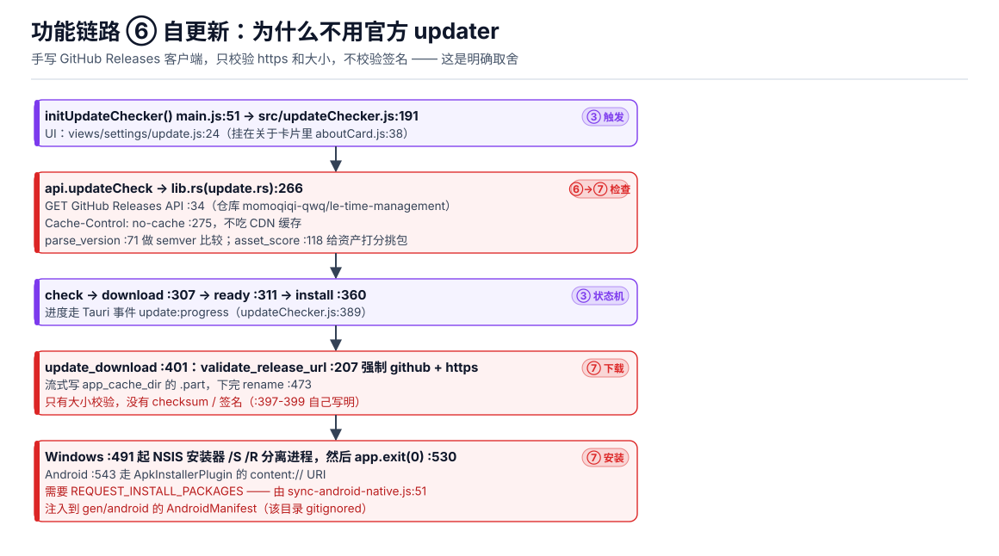

# Le时间管理 · 软件层次图与功能实现说明

> 基准版本 **v0.58.2** · 规模：前端 12,684 行 JS / Rust 2,894 行 / 15 个内置插件 / 52 个测试脚本
> 本文是纯文档，不进产品 bundle，按 [`AGENTS.md`](../AGENTS.md) 铁律一**不需要**升版本号。
> 所有图由 `node tools/gen-architecture-diagrams.js` 生成到 `docs/architecture/`，改文案不用手画。

---

## 0. 一句话架构

> **一套无框架的原生 JS 前端，靠一个 `api.js` 门面跨到 Rust 内核，数据只落一个本机 JSON 文件；
> 功能扩展不是「改代码」而是「往文件夹里放插件」；Android 与小程序分别是「同一个前端换容器」和
> 「同一套逻辑换运行时」。**

三条不成文但真实存在的硬规则，读图前先记住：

| # | 规则 | 违反后果 |
|---|---|---|
| 1 | **依赖单向向下**：① 呈现 → ③ 编排 → ④ 状态 → ⑥ IPC → ⑦ Rust，下层永不 import 上层 | 循环依赖，插件与视图互相牵制 |
| 2 | **可变状态只有 `store.js` 一处**，任何写都要走 `changed()` | 绕过它就绕过落盘与刷新，界面和磁盘不一致 |
| 3 | **生成物不能手改**：`pluginCatalog.js`、`theme-derived.css`、两个插件的 `main.js`、`gen/android` | 改了会被下次生成覆盖，或被 `--check` 拦下 |

---

## 1. 全局层次图


### 各层职责与技术选型

| 层 | 位置 | 干什么 | 允许依赖 |
|---|---|---|---|
| **① 界面 / 呈现** | `src/shell.js`(1572) + `src/views/*` | 外壳、视图注册与切换（**清单按平台裁剪**）、详情抽屉、命令面板 | ②③④⑤ |
| **② 外观 / 交互横切** | `src/ui.js`、`theme.js`、`uiScale.js`、`motion.js`… | DOM 原语 + 只写 CSS 变量，**不碰业务数据** | 无（叶子） |
| **③ 功能编排（用例）** | `capture.js`、`timeParser.js`、`scheduleConflict.js`、`syncLayer.js`… | 把「一个功能」串起来的近无状态逻辑 | ④⑥ |
| **④ 状态 / 数据** | `store.js`(287) + `migrations.js` | 唯一可变状态中枢、缓存、防抖、串行写 | ⑥ |
| **⑤ 扩展 / 插件** | `pluginHost.js`(430) + `public/plugins/`×15 | `tide` 契约 + 12 个权限位，把插件变成视图和任务 | ③④⑥ |
| **⑥ IPC 门面** | `api.js`(247) | 35 个 command 名集中在此；非 Tauri 时退 localStorage | ⑦ |
| **⑦ Rust 原生能力** | `src-tauri/src/`(2,894) | 文件系统 / HTTP / 加密 / 托盘 / 更新 / LAN / 系统集成 | 平台 |
| **⑧ 容器 / 构建** | Tauri 2 + Vite 6 + Gradle | WebView2 / WKWebView / Android WebView 三种壳 | — |
| **⑨ 小程序平行栈** | `miniprogram/` | 原生 WXML，与桌面**共用工具链和数据格式**，运行时完全独立 | wx.\* |
| **横切 A 代码生成** | `tools/` | 改事实源必须重跑，否则测试拦截 | — |
| **横切 B 质量保障** | `scripts/test-*.mjs` ×52 | `npm test` 串跑，含版本一致性 / 主题对比度 / 安全区回归 | — |

### 启动顺序（`src/main.js` 的 `boot()`，顺序本身是设计）

```
applyTouchZoomViewport()   ← 必须在首屏渲染前改 viewport（手机端双指缩放）
  ↓ await initStore(seed())  ← 种子数据故意留空，读盘失败也不能脏
  ↓ initTheme / initUiPreferences / initUiScale / applyWindowSize（不阻塞）
  ↓ initMotionInteractions
  ↓ renderShell(#app)        ← 唯一的 shell 入口，此后界面可用
  ↓ initCapture / TaskReminders / CommandPalette / GlobalShortcuts / UpdateChecker
  ↓ api.appInfo().then(initAutomation)
  ↓ Tauri-only listen(): lan-command / app-quit
  ↓ initPluginHost()         ← 故意排在最后且不 await：插件慢不拖首屏
```

---

## 2. 八条功能链路：功能到底是怎么实现的

### 2.1 任务表（内部 id 仍是 `quadrant`）


**先把名字对齐**：界面上这一页叫**「任务表」**，副标题「先决定，再动手」（`shell.js:46` 的
`VIEWS` 条目，v0.58.0 由「四象限」更名而来）。代码里的 `quadrant`、任务字段 `quad`、
`QUADS` 都是**内部标识符，没有跟着改**，读源码时按「任务表 = 四象限」理解即可。

**怎么实现**：四格定义写死在 `ui.js:157` 的 `QUADS`，`renderQuadrant()`（`views/quadrant.js:336`）
只铺卡片，格子面积差由纯 CSS Grid 的 `1.16fr 1fr` 给出（`styles.css:369-371`，Q1 ≈ 1.35× Q4），
不在 JS 里算权重；数据读自 `S.tasksOfQuad(q)`（`store.js:222`）。
格子**内部**的拖拽换位由 `quadrant.js:77-263` 的 `attachListDrag()` 自己做（未用 `ui.js:113` 的
`pointerDrag()`，那套给时间块用）：鼠标 6 px / 触摸 240 ms 长按启动，松手时算出落点下标交给
`S.moveTaskRelative()`。**跨格拖动不存在** —— `moveTaskRelative()` 在 `store.js:238` 对比格与完成态，
不同就直接 no-op；改象限走详情抽屉的四个象限按钮。

**关键设计**：重渲染**不整屏重建**。视图注册一个 `S.subscribe`（`quadrant.js:365-369`），回调里
逐格调各自的 `_refresh` 并重算计数芯片，顶栏统计另有 `shell.js:1393` 的订阅；单格内容是
`replaceChildren` 重建而非逐卡片 diff。详情抽屉
（`views/drawer.js:10`）同理：改一个字段 → `S.updateTask()` → 局部 `refresh()`（:234）。

**删除为什么敢做「撤销」**：`deleteTaskUndoable()`（`store.js:153`）先把
`{ task, blocks: 该任务的所有块 }` **深拷贝成快照**，再调 `removeTask()` —— 删除是**立即生效并落盘**的，
函数返回的那个闭包才是「撤销」：它 `unshift` 回任务、`push` 回块，并且先做
`if (taskById(id)) return;` 与按块 id 去重，防重复插回。所以撤销**不依赖任何事务**，只是一次补偿写。

### 2.2 时间块规划轴


**怎么实现**：24 小时画布 + 左侧任务池（`S.poolOf()`，`store.js:213`）。拖拽落点先换算成分钟并
**15 分钟吸附**，放置前调 `previewSchedule()`（`scheduleConflict.js:64`）**只试算不落库**，
冲突就用 `findAlternatives()`（:33）以 15 分钟为步长**前向优先**找空档，找不到就 toast，
绝不悄悄覆盖用户已有的块。

**多视图为什么只有一个刷新入口**：`timeViews.js` 的 7 种非日视图（周 / 月 / 节奏…）由
`VIEW_META`（:4-12）驱动，**自己不 subscribe**，由父级 `syncView()`（:317）统一重绘 ——
父子各刷一次是闪动的来源。这是 v0.58.0 明确修过的点。

**时间块只在桌面上有**：核心视图清单**按平台裁剪**（`uiPreferences.js:10-11`，
`coreViewIds()` :12）——

| 平台 | 核心视图 |
|---|---|
| 桌面（Win / Linux） | 任务表 · **时间块** · **收件箱** · 插件 |
| APK | 任务表 · **时间线** · 插件 |

窄屏放不下 24 小时画布、收件箱也挤不进底栏，所以 Android 用「时间线」
（`views/timeline.js:32` `collectTimelineEvents()` → :58 `buildTimelineModel()`，按日期把安排与
截止串成卡片流）**同时替代**时间块和收件箱。`ensureActiveView()`（`shell.js:30`）在白名单不命中时
兜底落回 `quadrant`。**因此「时间块 / 收件箱」这两个词在图里默认指桌面端。**

### 2.3 中文时间捕获（招牌功能）


**怎么实现，五步**：

1. **入口**：`initCapture()`（`capture.js:15-22`）在 `document` 上挂 `dragenter/over/leave/drop/paste`。
   `wants()`（:63）**只看 `dataTransfer.types`，不读内容**，所以拖拽过程中的 hover 不卡。
2. **分类**：`onDrop`（:84）优先级 `Files` → `text/plain` → `uri-list` → HTML 去标签；
   `onPaste`（:100）在输入框内直接放过，剪贴板里是 `image/*` 就直送 AI。
3. **解析**：`parseWhen()`（`timeParser.js:4-138`）是**单趟正则表，不是文法**：
   全角转半角 → 语义改写（「今晚」拆成「今天 + 晚上」）→ `eaten[]` 记账（命中的片段从标题里
   删掉，所以标题不会残留时间词）→ 日期按 **7 级严格优先级**
   `rel > ymd > md > weekday > nextMonthDay > monthEnd > dayOnly` → 时间用**一条全局正则收齐所有
   命中** → 时段词映射 24 小时 → 第二个时间（`到|至|~|—`）作为结束并**继承前一个的时段**，
   这就是「下午3点到4点」能等于 15:00–16:00 的原因。
4. **分流**：`handleTextSmart()`（:214）**规则优先**，只有 `parseWhen` 找不到日期才叫 AI（:190）。
   成本纪律写在 `:207-213` 的注释里。
5. **提交**：`handleText()`（:142）**永远先建任务再排时间块**，排块时复用 2.2 的冲突避让。

**AI 那条路的三道安全阀**（`aiIngest.js`）：

- 密钥 / baseUrl / model 存在 **Rust 侧 AES-256-GCM vault**（`lib.rs:396-462`），
  **永远不进 `data.json`**，所以导出的备份天然不含密钥；
- AI 请求由 Rust `ai_chat`（`lib.rs:609`）代发，JS 侧碰不到密钥，也绕不开
  24 条消息 / 60k 字符的上限（`:619-632`）；
- **AI 输出永不直接写库**：`normalizeIngestEvent()`（:154）逐字段白名单钳制，
  `cleanIngestDate`（:54）会拒掉 `2026-02-31` 这种假日期，之后统一走 app API 落地。

只有 AI 路径有**可编辑预览面板**（`views/ingestPanel.js:67`）：逐行改类型
（`task|timeblock|inbox|course`）、标题、日期、开始时间，冲突项降级进收件箱，结果报告带撤销。
规则解析出的结果是确定性的，所以只 toast，不打断。

> ⚠️ 两个反直觉事实（画图时特意标红）：**拖进来的 URL 不会被抓取**（只当纯文本解析）；
> **本地没有 OCR**（`capture.js:266` 明说），`eng.traineddata` 是仓库根目录的孤儿文件，
> `webContent.js` 那 501 行网页抽取器是**给插件用的**，不在这条链路上。

### 2.4 插件系统：一个文件夹 → 导航栏一项


**怎么实现**：内置插件的 ID 是**构建期常量**（`pluginCatalog.js`，由 `tools/sync-plugins.js` 生成）；
外部插件由 Rust `list_plugins`（`lib.rs:753`）扫 `data_dir/plugins/*/manifest.json` 得到。
取码用 `fetch("/plugins/<id>/main.js?v=<版本>")` —— **版本号进 query 是刻意的破缓存手段**
（`pluginHost.js:97-99`）。最后 `new Function("tide", code)(makeApi(...))` 求值，
插件之间 `yieldUi()` 让出主线程。

**「沙箱」的真相（重要的诚实说明）**：`new Function` 只是**把 `tide` 这个名字传进去**，
它**不屏蔽 `document` / `window`**，没有 iframe 也没有 Worker。真正的边界是**契约 + 权限位**：
`makeApi()`（:112-301）每个方法第一行 `requirePermission()`（:44），
**缺权限直接 `throw`，不是静默降级**。12 个权限位见 `:23-36`
（`ui tasks blocks storage notify events http openUrl timeParse vault schoolImport sound`），
`scripts/test-plugin-permissions.mjs` 会静态核对每个 `main.js` 实际用到的 API 与 manifest 声明是否一致。
用户侧只提供「开 / 关」，没有逐权限授权。

**视图怎么挂上去**：`tide.ui.registerView()`（:180）进注册表 → `emitNavChanged()`（:392）
→ `shell.js:90` 的 `viewDef()` 按 `settings.pluginOrder` 排序，落进导航「插 件 视 图」分组，
键名 `plug:<viewId>`。真正挂载在 `commit()`（`shell.js:1100`，插件段 `:1122-1136`）里：
建 `.plugview` 容器 → `render(box, { refresh })` → 返回的 cleanup 连同「停掉动效观察器」
一起包成 `view._unsub`，切走时回收。**插件 render 抛错被 try/catch 接住**，
就地显示「插件视图出错：`<msg>`」（:1137），一个坏插件不会把整个壳打挂。

**插件写回核心数据（含防伪冒）**：以 `chaoxing-notify/main.js:554` 的 `toReminder()` 为例 ——
`util.parseWhen` → `tide.tasks.create()` → 宿主在 `pluginHost.js:147` **强制覆写 `sourcePlugin`**
（`{ ...patch, sourcePlugin: pid }`，插件自己传的值无效；:145-146 的注释写明这是防伪装来源）
→ `store.addTask`（:121）→ `changed()` →
任务表当场出现；再 `tide.blocks.create({ taskId })` 排时间块，`notify` 带一个
`action: () => tide.util.navigate("timeblock")` 做跳转。

> ⚠️ 15 个插件里有 **2 个的 `main.js` 是生成物**：`shiguang-schedule`（`model.js`+`ui.js`+
> `adapters/cppu.js` 拼出来）、`exam-calendar`（`main.template.js` + `exam-data.json` 构建时
> 内嵌 80 条数据）。**直接改 `main.js` 等于白改**，改事实源再跑生成器。

### 2.5 本地存储：一次改动到磁盘的完整旅程


**写路径**（`store.js` 里只有 4 个函数）：

```
任意 mutation
  → changed()          :99   batchDepth>0 时只置 dirty，不立即动作
  → emitChanged()      :95   window 事件 tide:state-changed + subs 回调
  → scheduleSave()     :91   350ms 防抖：连改 20 次只落一次盘
  → queueSave()        :87   saveChain = saveChain.then(() => api.saveData(state))
                             ↑ 串行 promise 链，两个写永远不会交错
  → invoke("save_data")      lib.rs:734
  → fs::write("data.json.tmp") → fs::rename(tmp, path)   :737-741
```

**读路径**：`initStore()`（:75）→ `load_data` → **先 `migrateState()` 再 `normalizeState()`** →
`migrations.js:14-27` 逐级升 `dataSchemaVersion`，**遇到比 App 还新的数据版本直接抛错**（宁可打不开
也不做猜测式解析，避免静默降级把用户数据改坏）。

**退出握手**：托盘退出会 `emit("app-quit")` 并起线程等 Condvar（`lib.rs:1637`），
JS 侧收到后 `saveNow()`（`store.js:275`）再 `quit_ack`（`lib.rs:1576`）。**最多等 2 秒**。

**三个边界要说清**：

- 原子性只保证「不会读到半截 JSON」，**没有 `fsync`**（`sync_all`/`sync_data` 全仓库 0 次命中）
  —— 断电时 `rename` 的落盘顺序不受保证；
- **备份轮转在 JS 侧不在 Rust**：`dataCenter.js:114-121` 往 `localStorage` 键
  `le-time:auto-backups:v1` 写环形自动备份，条数钳制在 3–30（默认 7，设置项
  `settings.autoBackup.keep`）；
  导出格式有 JSON / CSV / ICS / xlsx（xlsx 懒 `import('xlsx')`，不占首屏 bundle）；
- 两条「同步」是**不同东西**：`syncLayer.js` 是**手动**推拉的 WebDAV 快照（Basic auth，
  明文 http 会警告）；`lan.rs` 是局域网 tiny_http **遥控**（token 门，`/api/state` 直读
  `data.json`，手机 15 秒轮询，**只读副本 + 2 个命令，没有合并**）。

### 2.6 自更新：为什么不用官方 updater



`update.rs` 是**手写的 GitHub Releases 客户端**（模块头 `:1-27` 自己写明没有用
`tauri-plugin-updater`）：`update_check`（:266）拿 `releases/latest`（`Cache-Control: no-cache`，
:275），`parse_version`（:71）比 semver，`asset_score`（:118）给资产打分挑包；
`update_download`（:401）用 `validate_release_url`（:207）**强制 github + https**，
流式写 `.part` 再 rename；Windows 安装起 `installer /S /R` 分离进程后 `app.exit(0)`，
Android 走 `content://` 交系统安装器（需要 `REQUEST_INSTALL_PACKAGES`）。

> ⚠️ **只校验大小，不校验 checksum / 签名**（`:397-399` 明确写了）。这是一个知情的取舍，
> 不是漏了 —— 读图时不该以为它有签名验证。

### 2.7 Android 适配：同一份前端为什么不变形


**第一步不是适配像素，而是换一套视图清单**：APK 走 `MOBILE_CORE_VIEWS`
（任务表 / 时间线 / 插件），**没有时间块和收件箱**，见 §2.2 的表。

**核心矛盾（AGENTS.md 铁律四，会反复踩的那条）**：`MainActivity.kt:84` 调了
`enableEdgeToEdge()`，状态栏 / 导航栏变成**透明浮层**盖在 WebView 上；按 Android 约定应用必须
自己消费 `WindowInsets`，而 **WebView 里 `env(safe-area-inset-*)` 恒为 0**，`viewport-fit=cover`
也救不回来。

**解法是双路**：MainActivity 读真实四方向 insets（横屏挖孔在侧边，所以四向都取；
底部取 `max(systemBars.bottom, ime.bottom)`），用 `evaluateJavascript`（:171-185）把
`--sat / --sab / --sal / --sar` 注入 `documentElement`，并在 `onPageFinished` **补注入一次**
（新文档会重置内联样式）。CSS 侧一律写
`padding-top: var(--sat, env(safe-area-inset-top, 0px))`。

> ⚠️ **`:root` 绝不能给 `--sat` 写兜底默认值**。变量一旦在 `:root` 有定义，`var()` 的第二个参数
> **永远不会被求值**，iOS / 桌面的原生 `env()` 就被彻底废掉。这条有回归断言守着
> （`scripts/test-android-layout.mjs`）。

另两处原生桥：**深浅色**走 `theme.js:180 → api.system_bar → system_bar.rs:60` 调
`setDarkIcons`（桌面直接返回 `{applied:false}`）；**原生课表** `native_schedule.rs:69` 在
Windows 起 `native/shiguang/ShiguangSchedule.exe`（主窗子进程 + stdin JSON 管道 + 等
`LE_READY`），Android 用 Intent 起 Compose 页，JS 侧 `ResizeObserver` 量宿主盒子对位
（`nativeSchedule.js:77-90`），失败就 `degrade()` 回 JS 版 —— **原生是增强，JS 是兜底**。

> ⚠️ `src-tauri/gen/android/` 是 gitignored 的，`tauri android init` 会**整个重建**它。
> 事实源在 `le-time-management/android/gradle/`，靠 `tools/sync-android-native.js` 复制 5 个 `.kt`
> 并打补丁（AndroidManifest 权限、`.SchoolImportActivity` 注册、`file_paths.xml`）。
> 漏跑这一步的表现是**手机端功能静默消失**，构建还是成功的。

### 2.8 小程序同源版：共享什么、分叉什么、靠什么不散


运行时**完全独立**（无 Tauri、无 npm 构建、8 page + 4 tabBar 原生 WXML），同步靠三件事：

| 共享的东西 | 靠什么保证 |
|---|---|
| 数据格式 | `core/store.js` 同 schema，备份 JSON **双向可恢复** |
| 时间解析 | `core/timeParser.js` **逐行移植**，唯一差异是 `dayOnly` 把 lookbehind 换成捕获组 + slice（iOS 16.4 以下的 JSC 不支持 lookbehind，写了会解析崩溃） |
| 插件目录 / 假期 / 考试数据 / 图标 | `tools/sync-plugins.js` 一次生成桌面和小程序两份产物 |
| 版本号 | `tools/sync-version.js` 覆盖 `miniprogram/core/appMeta.js` |
| 不散架 | `tools/test-miniprogram-core.js`（实跑 260 项断言全过，README 里的「39 个用例」已过时）+ `check-miniprogram.js` 静态校验 |

**分叉**：小程序**没有插件宿主、没有 `tide`**（微信禁止动态求值代码）。
`core/pluginRuntime.js` 是**每个插件的纯函数平行重写**（`weeklyReport` / `holidaySummary` /
`examFlow` / `dormDuty*` / `inboxDrop*`），界面硬编码在 `pages/plugin/index.js`，
按 `manifest.platforms.miniprogram === "native"` 决定有没有入口；网络层 `pluginNet.js` 手搓
cookie jar，因为 `wx.request` 不持久化 cookie。提醒从桌面的**自适应 setTimeout**（最长唤醒 5 分钟、
90 秒补偿窗）退化成**固定 `setInterval(15s)`**；声音从 **Web Audio 现场合成 7 种预设**
（零音频文件）换成 `InnerAudioContext` + 随包 wav。

---

## 3. 依赖矩阵（谁 import 谁）

```
main.js ──→ shell.js ──→ views/* ──→ store.js ──→ api.js ──→ [Rust invoke]
   │            │                        ↑           ↑
   │            └──→ backNav/railActions │           │
   ├──→ capture/automation/reminders ────┘           │
   ├──→ pluginHost.js（10 个模块引用）───────────────┘
   └──→ theme/uiPreferences/uiScale（② 层，横向可互引，只写 CSS 变量）

直接 import 数：store.js 20 · ui.js 17 · api.js 14 · pluginHost.js 10
```

* `store.js` 是**枢纽**（唯一持有可变状态），`ui.js` 是**叶子**（纯 DOM 原语，17 处引用无反向依赖）。
* 跨语言调用集中在 `api.js`（**35 个 `invoke("…")` command 名全部只在这里**）。
  但 Tauri 的 **JS 侧事件与窗口 API 是例外**：`main.js:55`、`shell.js:839/933`、
  `globalShortcuts.js:30/49`、`updateChecker.js:388`、`windowSize.js:95` 也直接摸
  `@tauri-apps/api`。
* 这些例外**一律用动态 `import()`**，不是顶部静态引入 —— 所以纯浏览器 DEV 模式下，
  只要不调到那条分支，`@tauri-apps/api` 就不会进执行路径。

---

## 4. 读图时该知道的薄弱点（都是现状，不是待办）

| # | 位置 | 事实 | 影响面 |
|---|---|---|---|
| 1 | `src/api.js:18` | 浏览器兜底键名仍是改名前的 `tidebalance-data`，违反铁律三（应为 `letime-data`） | 仅 DEV 纯浏览器运行；三端产物写 `data.json`，**不受影响** |
| 2 | `src-tauri/src/lib.rs:737` | `tmp + rename` 原子替换，但**无 fsync** | 极端断电下 `rename` 顺序不保证 |
| 3 | `src-tauri/src/update.rs:397` | 自更新**不校验签名 / checksum**，只校验 https 与大小 | 供应链信任完全押在 GitHub + TLS 上（模块头已自我声明） |
| 4 | `lib.rs:1637` + `main.js:71` | 退出握手**最多 2 秒** | 350ms 防抖窗口内退出且磁盘慢时，最后一次改动可能丢 |
| 5 | `pluginHost.js:379` | `new Function` **非真隔离**，插件仍可触达全局 | 靠权限位 + 代码审查，不是靠运行时 |
| 6 | `src-tauri/gen/android/` | gitignored 且会被 `tauri android init` 重建 | 漏跑 `sync-android-native.js` → 手机端功能**静默消失** |
| 7 | `eng.traineddata`（根目录 15MB） | 全仓库无 tesseract 引用 | 孤儿文件，白占仓库体积 |

---

## 5. 数据形态速查

```jsonc
// store.js:49 normalizeState 的输出，也是 data.json 的全部内容
{
  version,
  tasks:   [{ id, title, note, quad, done, estMin, tags, project,
              due, dueTime, reminderEnabled, reminderOffsets, createdAt,
              order /* v0.52.0 拖拽 */, sourcePlugin /* 宿主注入 */, attachments }],
  blocks:  [{ id, date, start /* "09:00" 字符串，不是分钟数 */, durMin,
              title, taskId, cat }],
  inbox:   [{ ..., source }],
  settings:{ lastView, curDate, viewMode, pluginOrder, railWidth,
             uiScale, theme, themeMode, taskReminderLog, autoBackup, ... },
  plugins: { "<id>": { enabled, storage } },   // store.js:256 懒建
  automation: { rules, logs },
  dataSchemaVersion                            // migrations.js 逐级升
}
```

* 形状以工厂函数为准：`addTask()`（`store.js:121`）、`addBlock()`（:197）各写死一份默认值，
  `...patch` 覆盖。**时间是字符串** `"HH:MM"`，分钟数由 `mmOf()` 现算 —— 这也是
  `timeParser` 的 `startMin/endMin` 落库前必须转回去的原因。

* 派生缓存：`blocksOf(date)`（`store.js:190`）按日期分桶存进 `blockIndexByDate`，用
  `blockIndexVersion` 比对失效，失效函数 `invalidateBlockIndex()`（:63）在任何块增删时调用；
  `poolOf`（:213）、`tasksOfQuad(q)`（:222）、`placeTask`（:167）在其上做业务。
  `tasksOfQuad` 的排序是三层：**`done` 永远沉底 → 显式 `order`（v0.52.0 拖拽排序写入）优先 →
  无 `order` 兜底 `Infinity` 落回 `due` 规则**。
* 不进 `data.json` 的两类敏感数据：AI 密钥与插件凭据，分别在 `ai-vault` 和
  `plugin-vault.bin`（AES-256-GCM，`lib.rs:396/501`），**因此导出的备份天然不含密钥**。

---

## 6. 重新生成这些图

```bash
node tools/gen-architecture-diagrams.js
# 输出 docs/architecture/*.svg，并在 stdout 自检：
#   · 每行文字是否超出所在盒子宽度（CJK 按 1 字宽、ASCII 按 0.55 估）
#   · 所有元素是否落在画布内
# 看到「✓ 无文字溢出」才算干净；改文案后不放心就重跑一次。
```

图是 **SVG 矢量图**，浏览器 / VS Code / GitHub 直接渲染，放大不糊。需要 PNG 时用浏览器打开
`docs/architecture/00-layers.svg` 再截图，或任意图形工具导入。

> 想看**技术选型维度**的分层（依赖矩阵、版本快照、选型哲学），那是另一份：
> [`tech-stack.html`](tech-stack.html)。本文讲的是「功能如何穿过这些层」。
