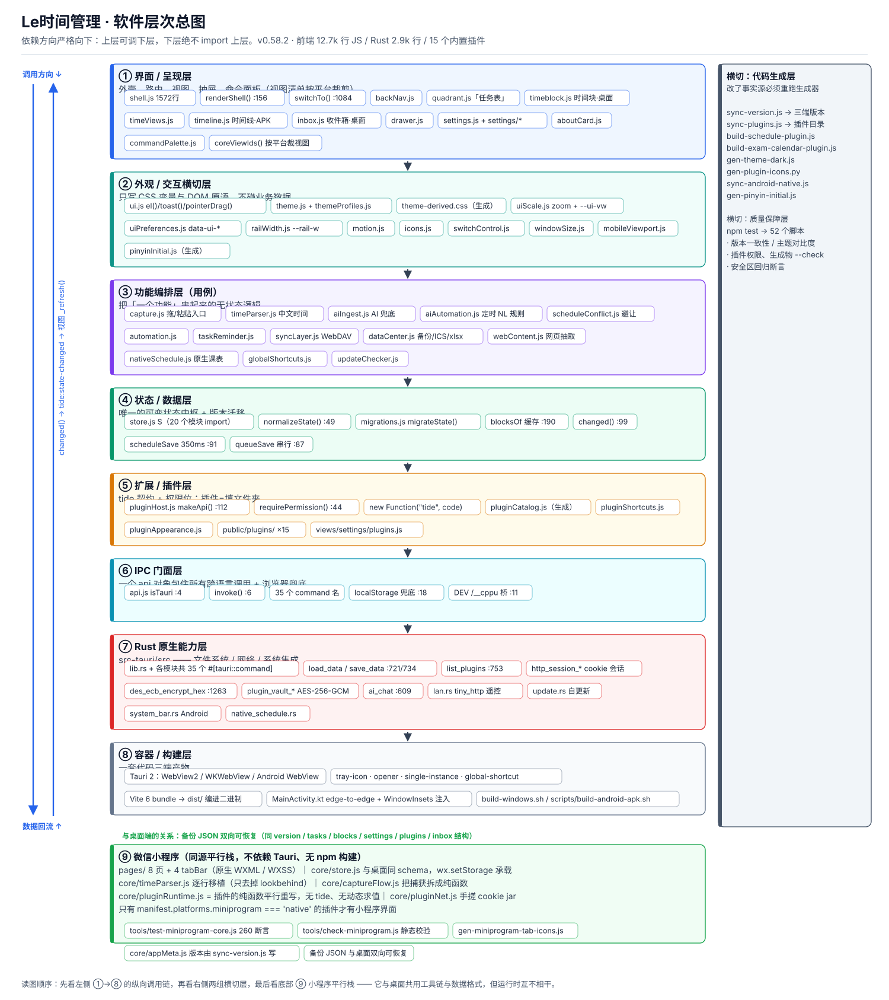
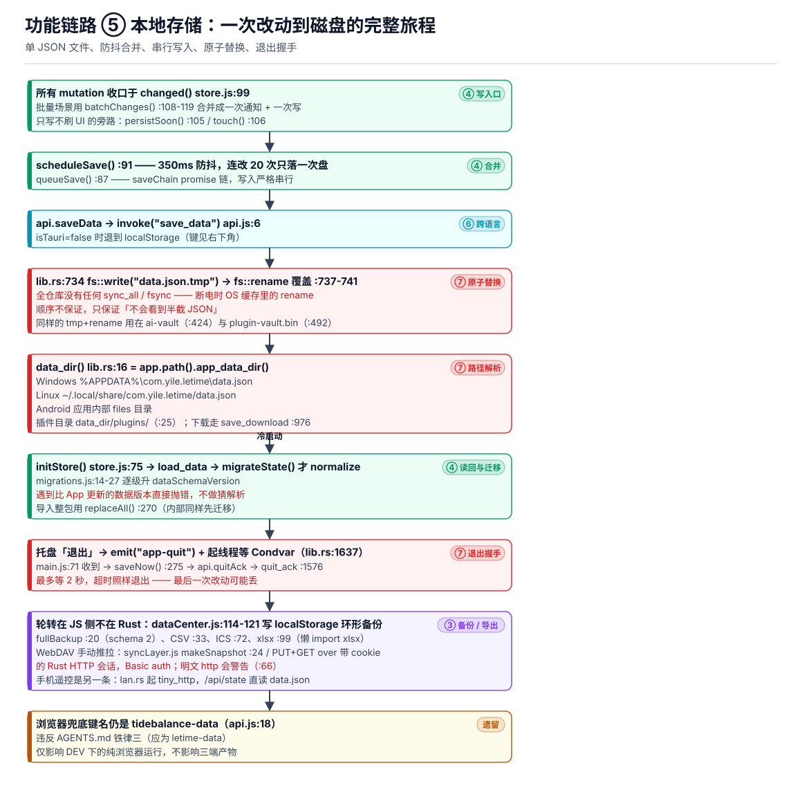
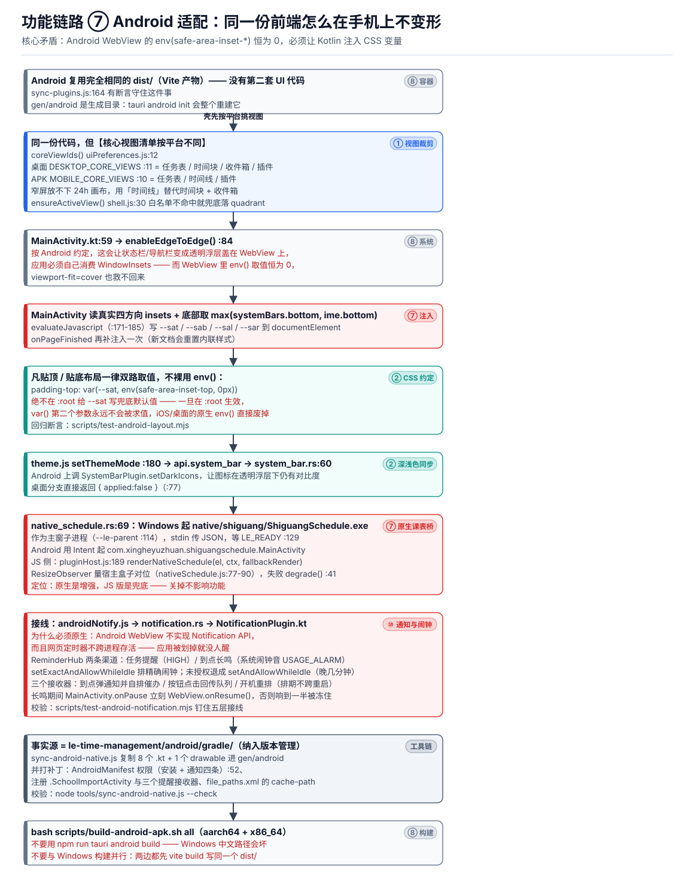
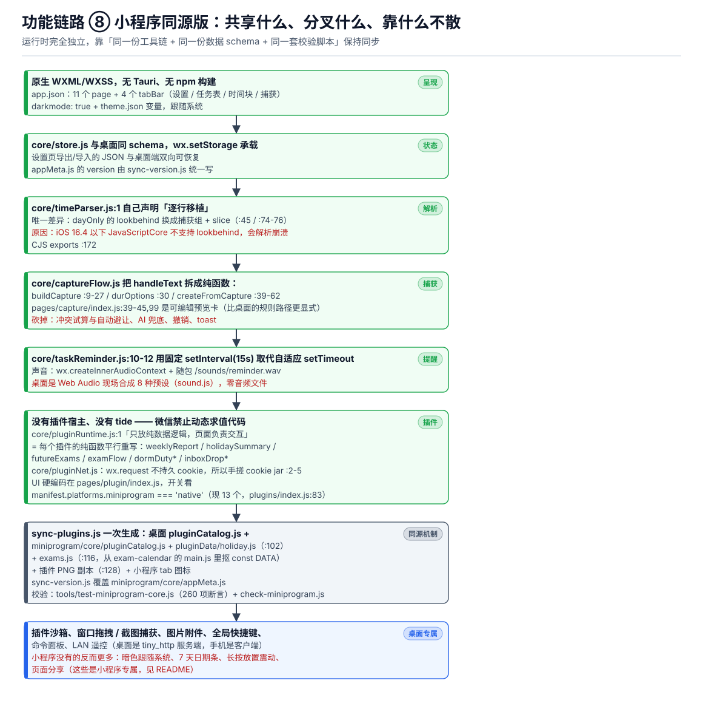
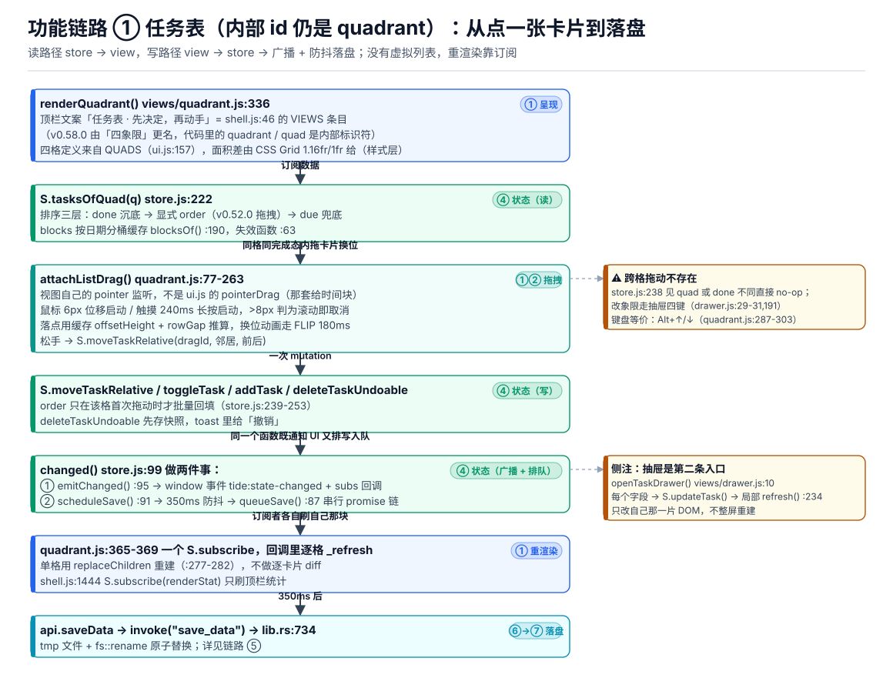
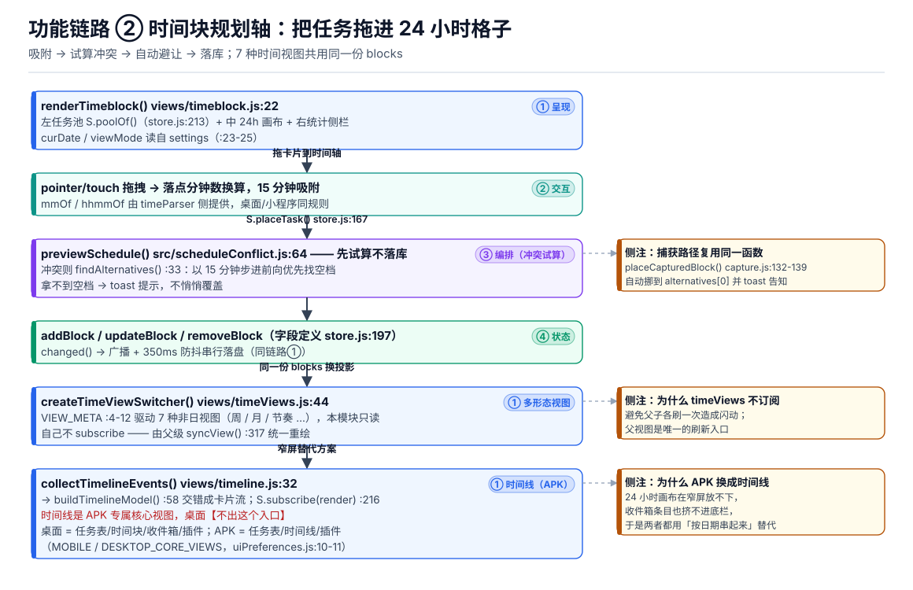
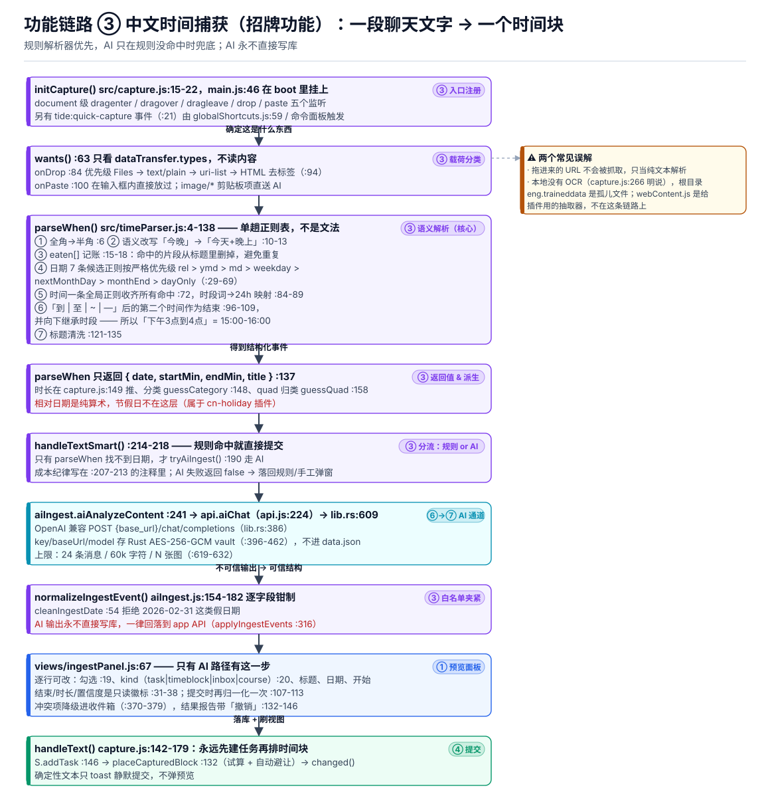
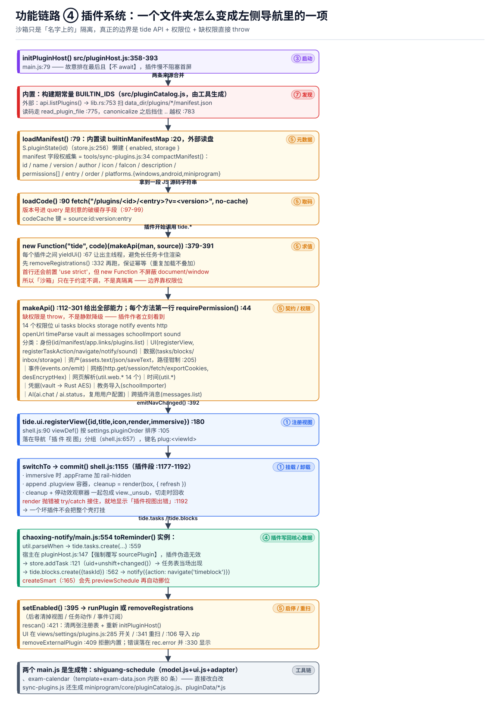
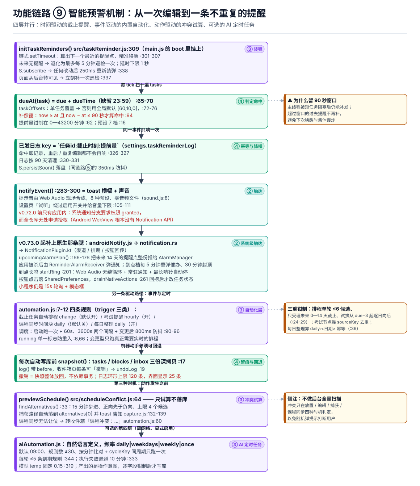

# Le时间管理 · 设计原则与整体架构说明

> **文档性质**：参赛技术材料（设计说明），面向评审专家。
> **基准版本**：v0.70.0 · **统计日期**：2026 年 9 月 19 日
> **配套材料**：《参赛作品介绍与参赛感言》讲「为什么做」，本文讲「怎么设计」（分层、模块方案、取舍），
> 「解决了哪些技术难题、代码怎么解的」另见同目录《工程实现与技术难题求解》；两篇不重复，那篇按难题组织、本篇按层次与模块组织。
> 面向开发者的扩展文档另见 `docs/index.html`（插件开发手册）、`docs/plugins.html`（插件使用说明）
> 与 `docs/架构层次图.md`（按层读代码的说明，本文图件即由其生成脚本产出）。
>
> 📌 本文件的图片按相对路径引用 `architecture/*.svg`，**单独把 .md 发给别人会丢图**。
> 需要"一个文件带走全部图"的自包含版本，跑一句：
> `node tools/embed-doc-images.js docs/设计原则与整体架构说明.md`
> → `output/设计原则与整体架构说明（图片内嵌版）.md`（约 200 KB，九张图以内联矢量方式嵌入，放大不失真）。

## 摘要

Le时间管理是一款面向高校学生的**本地优先**时间与信息管理软件，同一套产品设计覆盖 Windows / Linux 桌面、Android 手机端与微信小程序三种形态。

| 维度 | 当前规模 |
|---|---|
| 前端代码 | 13,607 行 JavaScript / 60 个模块文件（无 UI 框架） |
| 原生层 | 2,936 行 Rust（Tauri 2 命令与系统集成） |
| 小程序 | 7,671 行 JavaScript（与桌面同一套数据格式与解析规则） |
| 内置插件 | 15 个（课程表、考试日历、竞赛雷达、番茄专注等） |
| 自动化测试 | 55 个零依赖测试脚本，构建前置校验 |
| 运行时依赖 | 3 个（Tauri API、全局快捷键、xlsx 懒加载） |

本文的组织方式：第 1 章给出贯穿全产品的九条设计原则；第 2 章给出分层架构与数据流；第 3—7 章按评审要求逐模块说明设计方案；第 8 章列明质量保障手段与已知的工程取舍。文中所有论断均可定位到具体源码位置，标注格式为 `文件:行号`。

### 目录

| 章节 | 内容 | 图件 |
|---|---|---|
| 1 | 设计原则（九条） | — |
| 2 | 整体架构：分层、数据流、三端形态、启动时序、依赖矩阵 | 图 1—图 4 |
| 3 | 模块设计 ① 任务表 | 图 5 |
| 4 | 模块设计 ② 时间线（时间块 / 七种视图 / 移动端时间线） | 图 6 |
| 5 | 模块设计 ③ 收件箱（含中文捕获与分流） | 图 7 |
| 6 | 模块设计 ④ 插件系统 | 图 8 |
| 7 | 模块设计 ⑤ 智能预警机制（四层） | 图 9 |
| 8 | 工程质量与已知取舍 | — |
| 附录 | 数据结构速查、术语与命名对照、图件复现 | — |

---

## 1. 设计原则

产品设计的首要约束来自使用场景：学生的日程信息来源分散（教务系统、课程群、竞赛公告、导师消息），网络条件不稳定，数据隐私敏感，且使用者本身具备较强的"被软件支配"的抵触心理。由此形成九条原则。

### 1.1 本地优先（Local-first）

**主张**：全部核心链路不依赖网络，不要求账号，不上传数据。

**落地**：日程数据只落在应用数据目录下的单个 `data.json`；中文时间解析（`src/timeParser.js`）、象限判定、冲突试算（`src/scheduleConflict.js`）、提醒调度（`src/taskReminder.js`）、内置自动化（`src/automation.js`）均为纯本地执行。唯一需要网络的是可选的两类功能：AI 兜底解析与插件侧的信息抓取。

**代价与补偿**：本地存储意味着没有云同步，因此另行提供两条用户可控的跨端通道——WebDAV 手动推拉快照（`src/syncLayer.js`）与同一局域网下的直连遥控（`src-tauri/src/lan.rs`），二者都不引入自建服务器。

### 1.2 单一状态源

**主张**：可变状态在整个前端只存在一处，任何写入走同一个入口。

**落地**：`src/store.js` 是唯一持有业务状态的模块，被 26 个模块引用；所有变更必须经 `changed()`（`store.js:99`），该函数同时完成两件事——向界面广播刷新、把落盘任务排进串行队列。绕过它即等于绕过持久化。

**同类延伸**：版本号只写在 `package.json`，插件清单只写在 `manifest.json`，主题浅色只写在 `styles.css`，Android 原生代码事实源只在 `android/gradle/`。四处都由根目录 `tools/` 下的生成器分发到各端，并由 `--check` 模式校验一致性（见 1.9）。

### 1.3 分层与单向依赖

**主张**：依赖只能自上而下，跨语言调用必须收口。

**落地**：九层结构（详见 2.1）。呈现层不直接接触磁盘，状态层不感知界面；所有跨语言调用集中在 `src/api.js` 一个门面内，35 个 Tauri command 名只在该文件出现（`api.js`），非 Tauri 环境自动退回 `localStorage`。

**收益**：替换容器（桌面 → Android → 纯浏览器调试）不需要改动业务代码；审计"这个软件能碰机器的哪些地方"只需读两个文件。

### 1.4 最小依赖与零框架

**主张**：能用语言原生能力解决的，不引入框架。

**落地**：前端使用原生 DOM API 与 ES Module，未引入 React / Vue 及任何状态管理库；构建只用 Vite，运行依赖共 3 个（xlsx 按需动态 `import()`，不进首屏包）。Rust 侧同样克制，`lib.rs` 承担绝大部分命令实现。

**代价**：视图层的 DOM 组织、局部刷新、拖拽交互全部自研，代码量体现在 `src/ui.js` 与各视图文件中；换来的是极小的安装包、可预测的渲染行为与无框架升级负担。

### 1.5 宿主优先：功能扩展以插件形式发生

**主张**：核心保持精简，长尾需求交给插件层。

**落地**：核心只提供任务表、时间块、收件箱、插件四类视图，其余 15 项能力（课程表、考试日历、竞赛雷达、番茄专注、周度汇总、RSS 信息流……）全部实现为 `public/plugins/<id>/` 下的一个文件夹（第 6 章）。宿主向插件注入受权限约束的 `tide` 契约。

**判断依据**：不同学生的需求差异极大（保研党、竞赛党、社团骨干所需工具几乎不重叠），把选项做全不如把接口做正。

### 1.6 跨端一致，按端裁剪

**主张**：三端共用数据格式与业务规则，但界面清单按平台能力分别定义。

**落地**：核心视图清单由 `coreViewIds()` 按运行时返回——桌面为「任务表 / 时间块 / 收件箱 / 插件」，移动端为「任务表 / 时间线 / 插件」（`src/uiPreferences.js:10-11`）。窄屏无法承载 24 小时拖拽画布，因此手机上不提供该交互，而不是把它压缩变形。时间解析器在小程序侧是逐行移植的同源实现，仅在一处正则上因 iOS JavaScript 引擎不支持后行断言而做了等价改写。

### 1.7 不确定即不猜：宁可提示，不可覆盖

**主张**：任何可能改动用户既有数据的操作，遇到不确定时选择停下来询问。

**落地**：
- 排程冲突只试算不落库（`previewSchedule()`），找不到空档就提示，不覆盖已有时间块（`src/scheduleConflict.js:64`）；
- 课程表同步时只移动由任务产生的可移动块，其余视为固定日程，仍冲突则生成收件箱条目交用户判断（`src/automation.js:54-60`）；
- 数据文件版本高于当前程序支持的版本时直接拒绝打开，而不做猜测式解析（`src/migrations.js`）；
- AI 返回的结果永不直接写库，逐字段白名单钳制并校验日期合法性（`src/aiIngest.js:54,154`）。

### 1.8 可恢复优先：机器改动必须可撤回

**主张**：自动化与危险操作的价值，取决于它是否可撤销。

**落地**：删除任务采用"补偿写"而非事务——先深拷贝任务及其时间块快照，删除立即生效，返回的闭包负责按 id 去重后放回（`store.js:153-165`），撤销能力不依赖任何数据库事务；自动化每一次改动都在日志里留下完整快照并支持一键还原，日志环形上限 120 条（`automation.js:17-19`）；自动备份环形存储在本地，条数可配（默认 7 条，3—30 可调）；导出格式覆盖 JSON / CSV / ICS / xlsx。

### 1.9 约定必须可校验

**主张**：写在文档里的规矩，如果测试不检查，就一定会被破坏。

**落地**：55 个测试脚本由 `npm test` 串行执行、遇错即停，其中相当比例是"元校验"而非功能测试——版本一致性校验、主题深色的 WCAG 对比度校验、插件 `manifest` 声明权限与实际调用是否相符的静态校验、Android 安全区回归断言。此外 `tools/test-miniprogram-core.js` 单独对小程序核心逻辑跑 260 项断言。构建脚本 `npm run build` 的第一条命令即 `sync-version.js --check`，版本不一致无法产出安装包。

---

## 2. 整体架构设计

### 2.1 分层总览

**图 1** · 软件层次总图：

| 层 | 位置 | 职责 | 允许依赖 |
|---|---|---|---|
| ① 界面 / 呈现 | `src/shell.js` + `src/views/*` | 外壳、视图注册与切换（清单按平台裁剪）、详情抽屉、命令面板 | ②③④⑤ |
| ② 外观 / 交互横切 | `src/ui.js`、`theme.js`、`uiScale.js`、`motion.js` | DOM 原语与主题变量，只写 CSS 变量，不触碰业务数据 | 无（叶子层） |
| ③ 功能编排（用例） | `capture.js`、`timeParser.js`、`scheduleConflict.js`、`automation.js`、`syncLayer.js` | 将单个功能串起来的近无状态逻辑 | ④⑥ |
| ④ 状态 / 数据 | `store.js` + `migrations.js` | 唯一可变状态中枢、派生缓存、防抖与串行写 | ⑥ |
| ⑤ 扩展 / 插件 | `pluginHost.js` + `public/plugins/`（15 个） | `tide` 契约与 12 个权限位，把插件呈现为视图与任务 | ③④⑥ |
| ⑥ IPC 门面 | `api.js` | 35 个 command 名集中于此；非 Tauri 环境退回 localStorage | ⑦ |
| ⑦ Rust 原生能力 | `src-tauri/src/`（2,936 行） | 文件系统、HTTP 会话、加密保管库、托盘、自更新、局域网服务、系统集成 | 平台 |
| ⑧ 容器 / 构建 | Tauri 2 + Vite 6 + Gradle | WebView2 / WKWebView / Android WebView 三种宿主 | — |
| ⑨ 小程序平行栈 | `miniprogram/` | 原生 WXML 实现，与桌面共用数据格式与解析规则，运行时完全独立 | `wx.*` |
| 横切 A 代码生成 | `tools/` | 事实源变更后的产物同步与校验 | — |
| 横切 B 质量保障 | `scripts/test-*.mjs`（55 个） | 功能测试与元校验 | — |

### 2.2 数据流：一次改动到磁盘的完整旅程

**图 2** · 存储链路：

```
界面交互 → 编排层用例 → store 变更 → changed()
                                       ├─ emitChanged()  → 订阅者局部刷新（同一 tick 内合并）
                                       └─ scheduleSave() → 350 ms 防抖 → queueSave() 串行 Promise 链
                                                            → api.saveData → invoke("save_data")
                                                            → 写 data.json.tmp → fs::rename 原子替换
```

要点有三：写入以 Promise 链串行化，两次落盘永不交错（`store.js:87`）；连续编辑 20 次只产生一次磁盘写入；读回时先做版本迁移再做字段规范化，保证进入内存的数据形状恒定（`store.js:49`、`migrations.js`）。原子替换保证"不会读到半截 JSON"，此处未使用 `fsync`，是知情的取舍（见 8.2）。

### 2.3 三端形态

三种形态不是三份产品，而是同一设计的三种投影：

| | 桌面（Windows / Linux） | Android（Tauri APK） | 微信小程序 |
|---|---|---|---|
| 运行时 | WebView2 / WKWebView + Rust | Android WebView + Rust | 微信原生运行时 |
| 核心视图 | 任务表 / 时间块 / 收件箱 / 插件 | 任务表 / 时间线 / 插件 | 四个 Tab：设置 / 任务表 / 时间块 / 捕获 |
| 插件 | `tide` 宿主 + 15 内置 + 外部目录 | 同桌面 | 无插件宿主，10 个插件的逻辑逐一手移植为纯函数 |
| 数据 | `data.json`（Rust 文件 IO） | 同桌面 | `wx.setStorage`，同一 schema，备份 JSON 双向可恢复 |

**图 3** · Android 适配链路：
**图 4** · 小程序同源链路：

Android 侧最值得说明的是安全区适配：原生 `MainActivity` 启用 Edge-to-Edge 后，状态栏与导航栏成为透明浮层，而 WebView 内 `env(safe-area-inset-*)` 恒为 0。因此由原生侧读取真实 `WindowInsets` 四方向数值，注入为 `--sat / --sab / --sal / --sar` 四个 CSS 变量，样式一律写作 `var(--sat, env(safe-area-inset-top, 0px))` 的双路形式，并在页面加载完成后补注入一次。该机制有回归断言保护（`scripts/test-android-layout.mjs`）。

### 2.4 启动时序

启动顺序本身是一项设计，`src/main.js` 的 `boot()` 依次执行：视口策略（必须在首屏渲染前）→ 状态初始化（种子数据故意留空，读盘失败不污染）→ 主题 / 界面偏好 / 窗口尺寸（不阻塞）→ 交互增强 → 渲染外壳 → 捕获、提醒、命令面板、快捷键、更新检查 → 自动化 → 插件宿主。

其中最后一项刻意排在末尾且不等待其完成：**插件加载慢或出错，都不应当影响首屏可用**。

### 2.5 依赖矩阵

```
main.js ──→ shell.js ──→ views/* ──→ store.js ──→ api.js ──→ Rust invoke
   │            │                        ↑           ↑
   ├──→ capture / automation / reminders ┘           │
   └──→ pluginHost.js（10 个模块引用）────────────────┘
```

`store.js` 是被引用最多的枢纽（26 处），`ui.js` 则是纯叶子（24 处引用它，而它只引用同层的 `motion.js`，不依赖任何业务模块）。Tauri 的事件与窗口 API 是唯一的例外入口，且一律使用动态 `import()`，因此在纯浏览器开发模式下不会进入执行路径。

---

## 3. 模块设计 ①：任务表

**图 5** · 任务表链路：

### 3.1 设计目标

任务表是产品的入口视图，回答"接下来该做哪一件"。它采用经典的艾森豪威尔四象限（重要 × 紧急）作为组织方式，页面文案为"任务表 · 先决定，再动手"（`src/shell.js:46`）。设计上要解决三个问题：如何让"决定"这件事本身可见、如何让高频操作（勾选、换位、删除）成本足够低、如何避免局部操作引发整屏重绘。

> 命名说明：界面名称为「任务表」，代码内部标识符仍为 `quadrant` 与任务字段 `quad`（v0.58.0 更名时仅改文案，未改内部标识符，以避免破坏既有存档）。

### 3.2 数据结构

任务对象共 16 个字段（13 个有默认值，定义于 `store.js:122-128`；3 个按需写入）：

| 字段 | 类型 | 含义 |
|---|---|---|
| `id` / `title` / `note` | string | 标识与内容 |
| `quad` | 1–4 | **象限归属，由用户设定并存取** |
| `done` | boolean | 完成状态 |
| `estMin` | number | 预估耗时（分钟），排程时作为块长 |
| `due` / `dueTime` | `YYYY-MM-DD` / `"HH:MM"` | 截止日期与时刻，时刻缺省 23:59 |
| `reminderEnabled` / `reminderOffsets` | boolean / number[] | 提醒开关与提前量（见第 7 章） |
| `tags` / `project` | array / string | 标签与项目归组 |
| `createdAt` | number | 创建时间戳 |
| `order` | number | 组内手工排序位（首次拖动时才回填） |
| `sourcePlugin` | string | 来源插件标识，**由宿主强制写入** |
| `attachments` | array | 随任务带入的图片（可选） |

需要澄清一点：象限归属不是由"重要性""紧急性"两个字段计算出来的，而是**用户直接选择的结果**。系统仅在捕获环节提供一次规则建议：无日期者归入第二象限，截止在两天内的归入第一象限，其余归入第二象限（`timeParser.js:158-163`）。这一克制的设计是有意的——重要与紧急的判断本身应当由使用者完成，软件负责让判断变得廉价。

### 3.3 关键机制

**象限面积即优先级提示。** 四格布局由纯 CSS Grid 定义 `1.16fr 1fr / 1.16fr 1fr`（`styles.css:369-371`），第一象限视觉面积约等于第四象限的 1.35 倍。不用脚本计算权重，浏览器布局引擎即可承担，同时天然响应窗口尺寸变化。

**组内拖拽换位。** 拖拽由视图层自行实现（`views/quadrant.js:77-263`），鼠标与触摸共用一套 Pointer 事件：鼠标位移超过 6 px 判定为拖拽，触摸需长按 240 ms 启动、随后位移超过 8 px 判定为滚动意图而取消——两套阈值是为了避免手机上"想滑动却把卡片拖起来"。落点计算使用缓存的 `offsetHeight` 与 `rowGap` 而非实时矩形，避免动画进行中的位置污染判定；换位动画采用 FLIP，时长 180 ms。落点确定后写回相对位置（`moveTaskRelative()`，`store.js:239-253`），`order` 字段只在该象限首次发生拖动时才批量回填，未被打乱过的列表不写入冗余数据。

**排序规则三层。** 完成态永远沉底 → 显式 `order` 优先 → 无 `order` 者按截止日期升序（`store.js:222-228`）。渲染排序与写回排序使用同一套键，保证"插到谁旁边"的判定与用户所见一致。

**跨象限移动不走拖拽。** 拖拽只在同象限、同完成态内生效（`store.js:238`）。改变象限通过详情抽屉的四个象限按钮完成，并提供 `Alt + ↑ / ↓` 键盘等价操作。这是明确的设计取舍：跨格拖拽在手机上误触成本高，而"决定一个任务去哪个象限"是值得一次确认的动作。

**删除即撤销。** `deleteTaskUndoable()`（`store.js:153-165`）先深拷贝任务与其全部时间块，再执行删除，返回的闭包负责放回并按 id 去重防止重复插入。因此撤销不依赖事务机制，界面上表现为删除提示条上的"撤销"按钮。编辑与拖拽不提供撤销栈，其风险由 1.8 节的自动备份承担。

**刷新粒度。** 一次进入任务表时注册一个状态订阅，回调内分别刷新四格与顶部计数（`views/quadrant.js:365-369`）；每格保留自己的 `_refresh`，因此搜索框输入与筛选切换只触发四格重算而不重建外壳。单格内容以 `replaceChildren` 重建，不做逐卡片增量 diff——在数百任务的规模下，重建一格的代价低于维护 diff 逻辑的复杂度成本。

### 3.4 边界

任务表不提供子任务、依赖关系与重复任务；这些能力中的日程类（课程表、考试节点）由插件与时间块承担。任务与时间块的关系是"一对多"，删除任务时其时间块一并进入快照。

---

## 4. 模块设计 ②：时间线

时间线是"把决定排进具体时刻"的模块族，包含桌面的 24 小时时间块画布、七种时间视图、移动端的时间线卡片流，以及冲突试算机制。

**图 6** · 时间块链路：

### 4.1 设计目标

在 24 小时画布上直观安排一天，并保证任何自动安排都不会破坏用户已有的安排；同时让同一份数据在不同意图下（看一天、看一周、看一学期）换一种投影，而不是各自维护一份数据。

### 4.2 数据结构

时间块只有 7 个字段（`store.js:198`）：

```
{ id, date: "YYYY-MM-DD", start: "HH:MM", durMin, title, taskId | null, cat }
```

三个刻意的选择：其一，`start` 存字符串而非分钟数，与 `data.json` 的可读性、ICS 导出格式以及小程序侧保持一致，分钟数在需要时现算；其二，不存 `end` 字段，结束时间由 `start + durMin` 推导，避免两个字段互相矛盾；其三，`taskId` 为空表示"非任务时间块"（课程、手工安排的固定日程），这是后续冲突处理区分"可移动"与"固定"的唯一依据。类别固定为 5 种（`store.js:280-286`），用于配色与统计。不支持重复规则：周期性事件由课程同步按当前教学周展开为具体块。

### 4.3 关键机制

**画布几何。** 起始 07:00（420 分钟）、终止 24:00，每小时 62 px，即 1 分钟约 1.03 px（`views/timeblock.js:9-12`）。块的位置与高度由线性映射得出，最矮高度 22 px 以保证短块仍可读（`timeblock.js:189`）。

**15 分钟吸附。** 落点与块移动全部对齐 15 分钟网格（`timeblock.js:105,117,206`），最短时长 15 分钟，且不允许跨零点——跨零点的块无法在一天画布上完整表达，宁可不给。拖动只改变开始时间而保持时长；时长通过块菜单以 ±15 分钟调整，延长前执行同一套冲突与越界校验（`timeblock.js:227`）。删除与"移回任务池"都在提示条上提供撤销动作。

**冲突事前试算。** 放置前调用 `previewSchedule()`（`scheduleConflict.js:64`），只做判定不写库。重叠判定采用严格半开区间 `待排.start < 已有.end && 待排.end > 已有.start`，自身块可排除。存在冲突时由 `findAlternatives()` 提供候选：以 15 分钟为步长从 0 开始向两侧扩展，**正向偏移先于负向入列**，因此给出的建议总是"最近的不晚于原意的空档"；候选数上限 4，且每个候选再次吸附到网格（`scheduleConflict.js:34-60`）。若一个空档也找不到，界面提示用户，绝不覆盖既有块。中文捕获链路复用同一函数，自动落到第一个候选并告知（`capture.js:132-139`）。

**固定日程与可移动块的分层。** 冲突判定对时间块一视同仁，但在课程同步场景中，只有带 `taskId` 的块会被让位，课程块与手工块视为固定；让位时从课程结束时间起向 22:00 以 15 分钟步进前扫（`automation.js:55-58`）。若让位后仍冲突，则放弃写入并生成一条"课程冲突：…"的收件箱条目请人处理（`automation.js:60`）。

**七种视图，一份数据。** 视图元数据集中定义于 `timeViews.js:4-11`：日时间轴、课时格、里程碑、横向时间轴、卡片时间轴、年度甘特、阶段甘特。其中只有"日时间轴"可编辑，其余六种渲染到独立的投影容器（`timeblock.js:317-323`）。课时格以周一为周首，阶段甘特以当月为锚。

**单一刷新入口。** 时间块视图注册唯一订阅，回调进入 `syncView() → renderAll()`，投影视图自身不订阅状态（`timeblock.js:324-333`）。父视图与子视图各自刷新是闪动的直接来源，此规则由 v0.58.0 的一次明确修正确立。卸载时通过容器上缓存的反订阅函数清理。

**移动端换形态而非缩放。** Android 端不提供时间块画布，而以「时间线」视图承担：把时间块与任务截止按日期聚合成卡片流（`views/timeline.js:32,58`），只读、可跳转，符合竖屏浏览与信息确认的需求。桌面端则不出现时间线入口。相反，微信小程序实现了自己的一套可编辑时间块页，复用同一套 07:00–24:00 与 15 分钟吸附规则（`miniprogram/pages/timeblock/index.js:3,7-12`），通过原生 movable-view 完成拖动。三者共享的是数据格式与规则，差异只在交互形态。

### 4.4 边界

画布起点是 07:00，凌晨时段不在画布上呈现（这类安排仍以 07:00 之后的时间块或任务形式管理）；时间块不支持重复规则，也不记录来源与外部标识，因此当前不做日历双向订阅。番茄专注不属于本模块，是插件提供的能力。

---

## 5. 模块设计 ③：收件箱

**图 7** · 中文捕获与分流链路（本章 5.4—5.5 引用）：

### 5.1 设计目标

收件箱解决的问题是：**系统自动产生的写操作，需要一个人在场确认的地方。** 它承担 GTD 式"先收集、后处理"里"待处理"的那一半，页面全名「收件箱与自动化」（`views/inbox.js:11`），由四张卡片构成：待确认事项、内置自动化规则、AI 自动任务、自动化日志。

### 5.2 数据来源与条目结构

关键设计是：**收件箱没有手工输入框**，条目只能由代码写入，共三类写入方——

| 写入方 | 入口 | 权限约束 |
|---|---|---|
| 插件消息 | `tide.inbox.create()` | 需 `tasks` 权限（`pluginHost.js:152-153`） |
| 内置自动化规则 | 考试节点、课程冲突等（`automation.js:41,60`） | 规则开关由用户控制 |
| AI 批量落格 | 识别结果中不确定项降级进入（`aiIngest.js:358-360`） | 逐条可编辑、可撤销 |

条目字段：`id`、`status`（`new` → `done`）、`createdAt`，以及写入方提供的 `source`（来源标签）、`sourceKey`（去重键）、`title`、`when`（展示串）、`note`、`suggestion`（建议动作）、`date` / `time`（结构化字段）、`attachments`、`meta`、`sourcePlugin`。

**去重由 `sourceKey` 保证**（`automation.js:32`）：同一来源同一事件重复上报不会堆积成刷屏通知。列表最多呈现 30 条未处理项（`views/inbox.js:16`），历史以 `done` 归档而非删除，保证可追溯。

### 5.3 展示串与结构化字段分离

条目同时携带 `when`（给人看的，如"2026-01-08 23:59"）与 `date` / `time`（给机器用的）。落格时只取结构化字段——把展示串直接当日期写入会产出非法日期，进而让提醒静默失效，这个坑在源码里以注释固化（`views/inbox.js:33-35`）。这是一条通用约定：**凡是会被下游解析的数据必须结构化存放，展示串只做展示。**

### 5.4 落格流程

条目上的动作取决于 `suggestion`：`create-task` 渲染为「建任务」按钮，写入一条第一象限任务，带上截止日期与时刻、以来源标签标记、附件一并带走，然后把条目置为已处理（`views/inbox.js:32-43`）；`open-course` 渲染为「打开课程表」，仅导航不写数据；其余条目提供「完成」即归档。

真正完整的四路分流（任务 / 时间块 / 收件箱 / 课程）出现在 AI 识别结果的预览面板：逐行选择类型、编辑标题与日期、显示置信度、冲突项自动降级进收件箱，整体结果报告带撤销（`views/ingestPanel.js:10-16,102-146`）。规则解析的结果是确定性的，因此只提示不打断。

### 5.5 与捕获链路的关系

需要区分两件容易混淆的事：**拖入或粘贴的文本不进收件箱**。窗口级的拖放与 `Ctrl+V`（`capture.js:15-22,84,100`）走的是"解析即落格"路径——中文时间解析成功就当场生成任务与可选时间块，图片则成为任务附件；只有需要人确认的自动化产物才进收件箱。

中文解析器 `parseWhen()`（`timeParser.js:4-138`）是一张单趟正则优先级表而非文法，能力覆盖：全角转半角；"今晚/明晚/今早"这类含时段语义的词先改写再解析；日期按 7 级严格优先级（相对日 → 完整年月日 → 月日 → 星期 → 下月 X 日 → 月底 → 裸"X号"），并对跨年、跨月做顺延；时间用一条全局正则收齐所有命中，12 类时段词映射到 24 小时制，支持"半/一刻/三刻/X分"；出现"到/至/~/—"时第二个时间作为结束并**继承前一个的时段词**，因此"下午3点到4点"能正确等于 15:00–16:00。命中的时间词从标题中剔除，所以标题不会残留时间片段。

明确的局限也在源码中记账：不支持"昨天/前天"等回溯表达，不对裸"3点"做上下午推断，不解析"预计1小时"这类时长（回落到默认 60 分钟），拖入的 URL 不会被抓取（仅作纯文本解析），本地不含 OCR。规则路径完全离线，只有解析不出日期时才调用可选的 AI（`capture.js:214-218`），AI 失败则回落手工选择时间。

### 5.6 自动化日志：机器改动的账本

每条自动化操作写入日志并携带操作前的完整快照（任务、时间块、收件箱三份深拷贝），界面显示最近 25 条并提供"撤销"，撤销即把快照整体放回并追加一条撤销记录（`automation.js:17-19`、`views/inbox.js:56`）。这一机制使 1.7 与 1.8 两条原则在收件箱页上同时可见：**自动化可以动手，但每一次动手都留痕、可回退。**

---

## 6. 模块设计 ④：插件系统

**图 8** · 插件系统链路：

### 6.1 设计目标

让"增加一种功能"等于"放入一个文件夹"，且不修改核心代码。插件必须能获得足够能力以做出真正的功能（读任务、排时间块、注册视图、发通知、抓网页），同时其能力范围可被机器校验。

### 6.2 插件包形态

一个插件目录的最小构成是 `manifest.json` 与入口脚本（缺省 `main.js`）：

```
public/plugins/<id>/
├── manifest.json      唯一声明文件（严格 JSON）
├── main.js            入口，接收 tide 契约
└── data/、src/ …      可选，仅能经 tide.assets.* 按相对路径读取（拒绝绝对路径与 ..）
```

manifest 共 11 个字段：`id`（必须与目录名一致）、`name`、`version`、`author`、`icon`、`faIcon`、`description`、`permissions[]`、`entry`、`order`（插件页排序）、`platforms.{windows,android,miniprogram}`（取值 `full / native / conditional / unavailable`，决定该插件在哪端出现入口）。`tools/sync-plugins.js` 是事实源校验器：字段缺省值补齐、id 重复即构建失败、平台取值非法即构建失败，并一次生成桌面与小程序两份 `pluginCatalog.js` 与图标副本。

值得说明的是**插件目录里没有 CSS**：宿主不注入插件样式表，插件样式由入口脚本自行处理；图标也不放在插件目录，而是统一由 `tools/gen-plugin-icons.py` 生成到 `public/icons/plugins/`。

### 6.3 契约：`tide` 能力面

宿主以 `makeApi()`（`pluginHost.js:112-301`）为每个插件构造一份专属视图对象，共九组能力：

| 能力组 | 方法 | 说明 |
|---|---|---|
| 身份 | `id`、`manifest`、`app.links`、`plugins.list()` | 插件只看到自己的标识与清单 |
| 数据 | `tasks.list/create/update/remove`、`blocks.list/preview/create/createSmart/update/remove`、`inbox.create` | `createSmart` 内置冲突避让；`tasks.create` 的 `sourcePlugin` 由宿主强制覆写（`pluginHost.js:147`） |
| 私有存储 | `storage.get/set` | 命名空间隔离在 `state.plugins[id].storage`（`store.js:256-260`），随主数据一起备份 |
| 凭据保管 | `vault.get/set/del` | Rust 侧 AES-256-GCM 加密文件，**永不进入 `data.json`**，故导出备份天然不含密钥 |
| 界面 | `ui.registerView`、`ui.registerTaskAction`、`util.openUrl`、`util.navigate` | 见 6.5 |
| 反馈 | `notify(msg)`、`sound.presets()/play()` | 通知自动带"插件名："前缀，归属清晰 |
| 协作 | `events.on/emit`、`schoolImporter.open/onMessage` | 进程内事件总线；宿主向插件的请求可收集各订阅者返回值 |
| 网络 | `http.get/getCached/session/fetch/exportCookies/restoreCookies` | 会话保持 Cookie，供教务类插件使用；`getCached` 用于降低轮询开销 |
| 工具 | `util.today/addDays/mmOf/hhmmOf/durLabel/parseWhen/guessCategory/guessQuad/desEncryptHex` 等 13 项 + `util.web.*` | 与核心共用同一个中文解析器，避免插件各写一套 |

**12 个权限位**（`pluginHost.js:23-36`）：`ui`、`tasks`、`blocks`、`storage`、`notify`、`events`、`http`、`openUrl`、`timeParse`、`vault`、`schoolImport`、`sound`。`makeApi()` 每个方法的第一行都是 `requirePermission()`，缺权限直接抛异常而不是静默降级（`pluginHost.js:38-48`）——让插件在开发期就暴露声明缺失。权限声明与真实调用的一致性由静态校验脚本 `scripts/test-plugin-permissions.mjs` 在每次 `npm test` 中核对。

需要如实说明的是：当前用户侧只提供插件"开 / 关"，**不提供逐权限授权**，因此权限位的价值主要在可审计与可校验，而非运行时的交互式授权。

### 6.4 装载、启停与更新

内置插件的 ID 是构建期常量（`pluginCatalog.js` 生成），外部插件由 Rust 侧扫描 `{app_data_dir}/plugins/*/manifest.json` 得到（`lib.rs:753-770`）。清单与入口脚本并行获取，但**按声明顺序依次执行**，每次之间让出主线程（`requestIdleCallback`），避免多个插件同时初始化阻塞首屏。

- **启用与停用**：默认启用；停用的插件仍登记但不执行代码。停用时主动回收其注册的视图、任务操作与事件订阅（`pluginHost.js:332-340`）。已知局限：插件自行创建的定时器与文档级监听器无法由宿主回收，因此插件手册要求插件在 `render` 的清理函数中自理。
- **安装方式**：文件夹放入、ZIP 导入（`import_plugin_zip`，支持 `<id>/manifest.json` 与根清单两种包结构）。
- **缓存策略**：入口脚本以 `fetch("/plugins/<id>/main.js?v=<version>")` 获取，版本号进查询串是刻意的破缓存手段；代码缓存键含 `来源:id:版本:入口`（`pluginHost.js:90-109`）。因此插件改动必须同时递增 manifest 版本，否则可能命中旧缓存——这是"版本号即缓存契约"的一处体现。

### 6.5 扩展点：插件如何变成界面

`tide.ui.registerView({ id, title, icon, render, immersive })` 注册后，宿主广播导航变更，视图按用户可拖拽的 `settings.pluginOrder` 排入侧栏"插件视图"分组，路由键为 `plug:<id>`；`immersive` 用于需要满屏的插件（课程表、甘特类）。挂载时创建带 `data-plugin-id` 的容器，调用 `render(el, { refresh })`；**若 `render` 返回函数，切走视图时宿主将其作为清理回调执行**（`shell.js:1180-1192`）。插件 `render` 抛出的异常被宿主捕获并在原位显示错误信息（`shell.js:1192`），一个坏插件不会打挂整个外壳。

`tide.ui.registerTaskAction({ id, label, icon, run })` 在任务详情抽屉中追加动作按钮（`views/drawer.js:91-93`），使插件能力出现在任务现场而不是只能在自己的页面里。键盘快捷键不由插件自行注册，宿主按显示名拼音首字母自动分配 `Alt + 字母`，避免冲突（`pluginShortcuts.js:57-101`）。

### 6.6 信任边界（如实说明）

插件代码与宿主运行在同一执行环境中：`new Function("tide", code)(api)` 只是把契约以形参注入，**不屏蔽 `document` 与 `window`，没有 iframe、Worker 或 Shadow DOM**。因此权限位是能力契约而非安全沙箱，真实的安全边界是"插件由用户自己放入 + 权限声明可静态审计"。这一点在插件手册的"信任边界"章节中已明确写出，本文同样如实呈现。

样式隔离同理：机制上只有 `.plugview[data-plugin-id]` 容器标记，实际依赖命名规范（各插件为自身类名加 `sg-`、`gx-`、`pp-` 等前缀）。因此宿主的裸类名（如 `.card`、`.switch`）存在渗入插件视图的可能，属当前已知缺陷而非已解决的机制。

### 6.7 当前插件与跨端策略

随包 16 个插件：课程表、网页收集、学校通知、番茄专注、周度汇总、RSS 信息流、竞赛消息雷达、学习通消息、门户通知、微信推送、中国节假日、考试日历、轮换值日、拖入消息收纳、插件开发指南、AI 对话。

小程序侧**没有插件宿主，也没有 `tide`**（微信运行时禁止动态求值代码）。清单经 `sync-plugins.js` 同步到 `miniprogram/core/pluginCatalog.js`，标记为 `platforms.miniprogram = "native"` 的 10 个插件以手移植的纯函数形式在 `core/pluginRuntime.js` 中平行实现，网络层 `core/pluginNet.js` 自行维护 Cookie jar。功能子集与交互退让是明确代价，换来的是零动态代码风险。

---

## 7. 模块设计 ⑤：智能预警机制

**图 9** · 智能预警链路：

### 7.1 设计目标

预警的目标不是"多提醒"，而是**在用户来不及反应之前提前一步说清楚**。四条设计要求：事前而非事后；说明原因并给出处置选项；同一事件不重复打扰；任何自动处置都可回退。

机制分四层实现：截止提醒（时间驱动）、内置自动化（事件驱动）、冲突与占用预警（动作驱动）、AI 自动任务（可选，自然语言定义）。前三层完全在本地运行、不依赖网络与账号，第四层需显式启用。

### 7.2 第一层：截止提醒（时间驱动）

`src/taskReminder.js` 提供多级提前预警。预设提前量为 1 天 / 2 小时 / 1 小时 / 30 分 / 10 分 / 5 分 / 到点（`taskReminder.js:6`），全局默认三档为提前 60 / 10 / 0 分钟，单个任务可覆盖也可整体关闭，取值钳制在 0—43200 分钟。

**调度方式：链式定时器 + 精准唤醒。** 每次 tick 结束后按"下一个最近的提醒时刻"设定下一次延时；未来无提醒时退化为最长 5 分钟巡检一次，延时下限 1 秒（`taskReminder.js:87-99`）。相较固定轮询，这使得空闲时的定时器唤醒次数近乎为零，而提醒时刻仍然精确。任何状态变化后 250 ms 重新装弹（改截止即生效），页面从后台切回可见时立即补一次巡检。

**补偿窗与幂等。** 判定条件是"当前时刻已过提醒点、且超出量不超过 90 秒"（`taskReminder.js:59`），因此主线程被短任务阻塞后仍能补发，而长时间错过的提醒不会在下次唤醒时集体轰炸。每个提醒点携带幂等键 `任务id:截止时刻:提前量`，命中即写入已发日志，因此同一次编辑不会重复触发；已发日志按 90 天清理。

**触达形式。** 应用内横幅提示 + Web Audio 现场合成的提示音（7 种预设，零音频文件）。系统级桌面通知的实现分支已预留，但以"权限已授予"为前置条件且程序当前不主动申请，因此**实际触达限于应用内**（`taskReminder.js:81-83`）。小程序侧退化为 15 秒轮询加模态对话框，一次仅弹一条（`miniprogram/core/taskReminder.js:10-11`）。

### 7.3 第二层：内置自动化（事件驱动）

`src/automation.js` 提供四条规则，触发时机分三类（`automation.js:7-12`）：

| 规则 | 触发 | 默认 | 行为 |
|---|---|---|---|
| 截止任务自动排程 | 数据变更后 | 开 | 为有截止日期但未排程的任务找空档并放置时间块 |
| 考试报名 / 打印 / 考试提醒 | 每小时 | 开 | 扫描考试日历中未来 7 天节点，写入收件箱 |
| 课程自动同步时间块 | 每日 | **关** | 按当前教学周把课程展开为时间块，冲突时让位或转收件箱 |
| 每日自动整理 | 每日 | 开 | 把逾期任务的截止日归到今天 |

**调度**：启动时先跑一次，之后两个常驻间隔（60 秒与 1 小时）配合数据变更后的 800 ms 防抖触发，并以单一 `running` 标志防止重入（`automation.js:6,66,90-96`）。变更型规则只做真正需要实时的排程，避免每次编辑都全量扫描。

**噪声与规模的三重钳制**：排程单轮最多处理 6 个候选、只受理未来 14 天内截止的任务、试排日期从"截止前 3 天"起向后逐日尝试直到截止日（`automation.js:24-29`），即"就近排但不过早占用"；考试节点用 `sourceKey` 去重；每日整理靠 `daily:YYYY-MM-DD` 幂等键保证一天只跑一次。

**可回退**：每一次自动写库前抓取任务 / 时间块 / 收件箱三份快照存入日志，收件箱页可逐条撤销（见 5.6）。

需要明确的一点是"每日自动整理"是**静默改写**逾期日期而非发出预警——它解决的是"逾期任务永远挂在过去"的观感问题，真正的逾期风险由第一层的提前提醒与任务表的排序（完成态沉底、按截止升序）承担。

### 7.4 第三层：冲突与占用预警（动作驱动）

这一层的预警发生在动作落库之前，因而是"事前"的：排程试算返回冲突数量与替代时段（`scheduleConflict.js:64-70`），捕获链路自动改到首个可行时段并明确告知（`capture.js:132-139`），课程同步无法让位时转为收件箱待确认（`automation.js:60`）。当前不做主动全量冲突扫描——冲突只在放置、编辑、捕获与课程同步四种时机出现，这是刻意设定的触发边界，以避免后台扫描带来的随机提示。

### 7.5 第四层：AI 自动任务（可选，自然语言定义）

`src/aiAutomation.js` 允许用户以自然语言描述周期性任务（如"每天早上把两天内要截止且没排程的任务建议一下"），由大模型产出**操作意图**而非直接写库。约束条件：频率限 `daily / weekdays / weekly / once`、默认时刻 09:00、规则数上限 30 条、按分钟比对并以 `cycleKey` 保证同一周期只跑一次、单周期最多处理 5 个截止任务、执行失败退避 10 分钟（`aiAutomation.js:292-344`）；调用模型时温度固定为 0.15 以降低输出漂移（`:316-320`）。

这一层与预警的关系需要说清：它是**可选的、显式启用的、依赖网络的能力**，不是默认预警路径。产品的默认预警完全是规则式的。同理，象限归属的"重要 / 紧急"判断也来自规则（`timeParser.js:158-163`），AI 只在其返回了明确象限时才覆盖该建议（`aiIngest.js:165`）。周度汇总（`plugins/weekly-report`）是只读的统计视图，不承担预警触发。

### 7.6 当前未提供的能力

为避免评审时的期待错位，明确列出：无勿扰时段 / 免打扰时间窗；无单条提醒的稍后再提醒（snooze）或永久静音状态；无操作系统级推送、无后台常驻提醒进程、无小程序订阅消息；无跨任务的前置依赖预警。这些都属于"关闭应用即停止预警"这一本地优先立场下的直接推论。

---

## 8. 工程质量与已知取舍

### 8.1 校验与测试

| 手段 | 覆盖 |
|---|---|
| `npm test`（55 个脚本，串行、遇错即停） | 视图行为、同步链路、安全区回归、权限一致性、插件专项 |
| `tools/test-miniprogram-core.js` | 小程序核心逻辑 260 项断言 |
| `sync-version.js --check` | 三端版本号一致；已是 `npm run build` 的前置步骤 |
| `gen-theme-dark.js --check` | 深色主题由浅色令牌按 WCAG 反解派生，两者必须同步 |
| `build-schedule-plugin.js --check` / `build-exam-calendar-plugin.js --check` | 生成型插件的入口产物与事实源一致 |
| `sync-android-native.js --check` | Android 原生 Kotlin 与清单声明是否进入构建目录 |

设计上的共同点是：**把"约定"变成断言**。仓库里有相当一部分规则无法靠代码审查长期维持（例如三端版本号、生成物不可手改），因此统一以生成器 + `--check` 双件套固化。

### 8.2 已知的工程取舍与薄弱点

| # | 位置 | 现状 | 影响与判断 |
|---|---|---|---|
| 1 | `store.js:91` + `lib.rs:1650` | 落盘 350 ms 防抖，退出握手最多等待 2 秒 | 极端情况下最后一次改动可能丢失；以本地环形自动备份兜底 |
| 2 | `lib.rs:737-741` | 写入为"临时文件 + 原子改名"，未调用 `fsync` | 保证不会读到半截 JSON，但断电时的落盘顺序不受保证 |
| 3 | `update.rs:397-399` | 自更新只校验 HTTPS 与文件大小，不校验签名与校验和 | 供应链信任建立在 GitHub 与传输层之上，模块头部已自我声明该取舍 |
| 4 | `pluginHost.js:350,384` | 插件与宿主同执行环境，权限位为能力契约非隔离边界 | 依赖用户自行放入 + 权限声明可静态审计；同时提供视图异常兜底 |
| 5 | 插件样式 | 无样式隔离机制，依赖类名前缀规范 | 宿主裸类名可能渗入插件视图，属已知缺陷 |
| 6 | `taskReminder.js:81-83` | 系统通知分支存在但不申请授权，实际不触发 | 预警仅应用内触达；关闭应用即停止预警 |
| 7 | `src-tauri/gen/android/` | 生成目录且不入库，`tauri android init` 会整体重建 | 需由 `sync-android-native.js` 补写，遗漏表现为手机端功能静默缺失 |
| 8 | 数据迁移 | 遇到高于当前支持版本的数据直接拒绝打开 | 宁可不打开也不做猜测式解析，避免静默改写用户数据 |

### 8.3 后续方向

按当前架构，以下三项是自然的延伸而不需要推翻设计：系统级通知与后台提醒（需引入权限申请与原生提醒通道，与本地优先立场需重新协调）、逐权限的交互式授权（权限位与校验脚本已就绪）、以及跨端合并式同步（当前两条通道均为快照推拉，无冲突合并）。

---

## 附录 A · 数据结构速查

`data.json` 的完整形态（`store.js:49` 规范化后的输出）：

```jsonc
{
  "version": 0,
  "tasks":   [{ "id": "", "title": "", "note": "", "quad": 2, "done": false,
               "estMin": 30, "tags": [], "project": "", "due": "YYYY-MM-DD",
               "dueTime": "HH:MM", "reminderEnabled": true, "reminderOffsets": [],
               "createdAt": 0, "order": 0, "sourcePlugin": "", "attachments": [] }],
  "blocks":  [{ "id": "", "date": "YYYY-MM-DD", "start": "HH:MM",
               "durMin": 30, "title": "", "taskId": null, "cat": "work" }],
  "inbox":   [{ "id": "", "status": "new", "source": "", "sourceKey": "",
               "title": "", "when": "", "note": "", "suggestion": "create-task",
               "date": "YYYY-MM-DD", "time": "HH:MM", "sourcePlugin": "" }],
  "settings": { "lastView": "", "curDate": "", "viewMode": "", "pluginOrder": [],
                "theme": "", "themeMode": "", "uiScale": 100, "railWidth": 0,
                "taskReminder": {}, "taskReminderLog": {}, "autoBackup": {} },
  "plugins":  { "<id>": { "enabled": true, "storage": {} } },
  "automation": { "rules": [], "logs": [] },
  "dataSchemaVersion": 0
}
```

两类数据**不进入** `data.json`，因此导出的备份天然不含凭据：AI 服务密钥与插件凭据分别存放在 Rust 侧的 AES-256-GCM 保管库（`lib.rs:396`、`lib.rs:501`）。

## 附录 B · 术语与命名对照

| 界面名称 | 代码内部标识 | 说明 |
|---|---|---|
| 任务表 | `quadrant`、任务字段 `quad` | v0.58.0 由「四象限」更名，内部标识符保留以兼容旧存档 |
| 时间块 / 时间线 | `timeblock` / `timeline` | 前者桌面可编辑画布，后者移动端只读卡片流 |
| 收件箱 | `inbox` | 页面全名「收件箱与自动化」 |
| 插件 | `market`（视图 id） | 侧栏文案为「插件」 |
| 插件全局契约 | `tide` | 品牌更名前遗留，现为 16 个插件依赖的对外契约，刻意保留 |

## 附录 C · 图件与复现

本文全部图件由 `node tools/gen-architecture-diagrams.js` 从代码结构生成到 `docs/architecture/`（SVG 矢量，放大不失真），生成时自检文字溢出与画布越界。文档本身不参与产品打包，不影响版本号（依 `AGENTS.md` 铁律一）。
